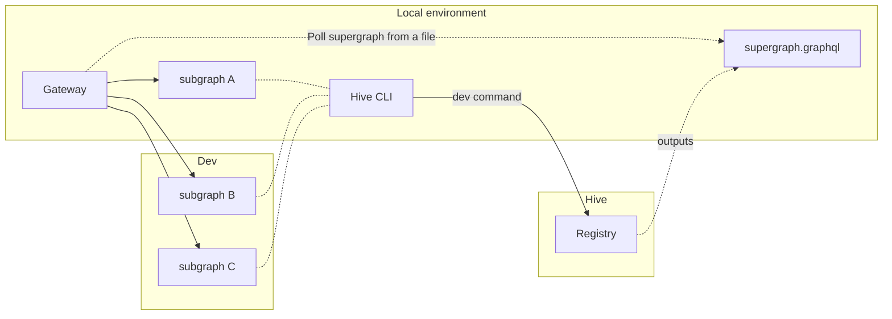

import { Callout, Tabs } from '@theguild/components'

# Hive CLI (Command Line Interface)

You can perform [schema-registry actions](/docs/schema-registry#actions-on-schemas) on your Hive
targets schemas using the Hive CLI.

## Installation

### NodeJS

If you are running a JavaScript/NodeJS project, you can install Hive CLI from the `npm` registry:

```sh npm2yarn
npm i -D @graphql-hive/cli
```

<Callout type="info">
  We recommend installing Hive CLI as part of your project, under `devDependencies`, instead of
  using a global installation.
</Callout>

### Binary

If you are running a non-JavaScript project, you can download the prebuilt binary of Hive CLI using
the following command:

<Tabs items={['MacOS / Linux', 'Windows']}>
  <Tabs.Tab>
    ```sh
    curl -sSL https://graphql-hive.com/install.sh | sh
    ```
  </Tabs.Tab>

  <Tabs.Tab>
    ```sh
    powershell -c "irm https://graphql-hive.com/install.ps1 | iex"
    ```
  </Tabs.Tab>
</Tabs>

#### Specific version

You can also download a specific version of the binary:

<Tabs items={['MacOS / Linux', 'Windows']}>
  <Tabs.Tab>
    ```sh
    curl -sSL https://graphql-hive.com/install.sh | sh -s "0.31.0"
    # or
    curl -sSL https://graphql-hive.com/install.sh | HIVE_CLI_VERSION="0.31.0" sh
    # or
    export HIVE_CLI_VERSION="0.31.0"
    curl -sSL https://graphql-hive.com/install.sh | sh
    ```
  </Tabs.Tab>

  <Tabs.Tab>
    ```sh
    $env:HIVE_CLI_VERSION="0.31.0"; powershell -c "irm https://graphql-hive.com/install.ps1 | iex"
    ```
  </Tabs.Tab>
</Tabs>

## Usage

### Publish a schema

<Callout type="info" emoji="🔑">
  This CLI command requires an active registry token with **Read & Write** permissions to the
  target.
</Callout>

<Callout>
  We recommend publishing the schema from your CI/CD pipeline. You can find more information in out
  [CI/CD Integration guide](/docs/other-integrations/ci-cd).
</Callout>

Start by setting your Hive token in
[`hive.json`](https://github.com/graphql-hive/platform/blob/main/packages/libraries/cli/README.md#config-file-hivejson)
file, or set it as `HIVE_TOKEN` environment variable.

Further reading:

- [Publishing a schema to the Schema Registry](/docs/schema-registry#publish-a-schema)

#### Single Schema Project

If you have a single file for your GraphQL schema:

```bash
hive schema:publish schema.graphql
```

Or, multiple files using a `glob` expression:

```bash
hive schema:publish "src/*.graphql"
```

Further reading:

- [`schema:publish` API Reference](/docs/api-reference/cli#hive-schemapublish-file)

#### Apollo Federation / Schema-Stitching projects

```bash
hive schema:publish --service reviews --url http://my-service.com/graphql schema.graphql
```

Further reading:

- [`schema:publish` API Reference](/docs/api-reference/cli#hive-schemapublish-file)
- [Apollo Router integration](/docs/other-integrations/apollo-router)
- [Apollo-Server integration](/docs/other-integrations/apollo-server)

#### Hive Metadata

If your GraphQL schema runtime requires any metadata to run, you can attach metadata to your schema
publication. Hive metadata published to Hive must be a valid JSON, and limited to `25MB`.

To attach metadata to your published schema, you can use `--metadata` flag when publishing.

You can load the metadata from a file:

```bash
hive schema:publish schema.graphql --metadata metadata.json
```

Or, use an inline JSON passed as a string:

```bash
hive schema:publish schema.graphql --metadata '{ "someData": true }'
```

Further reading:

- [Fetching Hive Metadata from the CDN](/docs/high-availability-cdn)

### Check a schema

<Callout type="info" emoji="🔑">
  This CLI command requires an active registry token with **Read** permissions to the target.
</Callout>

Start by setting your Hive token in
[`hive.json`](https://github.com/graphql-hive/platform/blob/main/packages/libraries/cli/README.md#config-file-hivejson)
file, or set it as `HIVE_TOKEN` environment variable.

Checking a GraphQL schema is the form of checking the compatbility of an upcoming schema, compared
to the latest published version.

This process of checking a schema needs to be done before **publishing** a new schema version. This
is usually done as part of a CI/CD pipeline, and as part of Pull Request flow.

Hive CLI will give you a list of all changes, sorted by criticality level (Breaking, Dangerous,
Safe) and fail the check once breaking change is detected.

```bash
hive schema:check schema.graphql
```

Or, multiple files using a `glob` expression:

```bash
hive schema:check "src/*.graphql"
```

If you want to leverage from retaining approved breaking changes within the lifecyle of a pull/merge
request or branch, you must provide the `--contextId` parameter. Using `--contextId` is optional
when using GitHub repositories and actions with the `--github` flag.

```bash
hive schema:check --contextId "pr-123" "src/*.graphql"
```

Further reading:

- [Publishing a schema to the Schema Registry](/docs/schema-registry#publish-a-schema)
- [Conditional Breaking Changes](/docs/management/targets#conditional-breaking-changes)

### Delete a schema

<Callout type="info" emoji="🔑">
  This CLI command requires an active registry token with **Read & Write** permissions to the target
  and the project.
</Callout>

<Callout type="info">
  This action is only available for Schema-Stitching and Apollo Federation projects.
</Callout>

Start by setting your Hive token in
[`hive.json`](https://github.com/graphql-hive/platform/blob/main/packages/libraries/cli/README.md#config-file-hivejson)
file, or set it as `HIVE_TOKEN` environment variable.

In case you want to compose a schema (or a subgraph in case of Federation), you can do so by using
the `hive schema:delete` command.

```bash
hive schema:delete SERVICE_NAME
```

<Callout>

You can also use `--dryRun` flag first to see what effect the command will have on the registry.

In case you want to confirm deletion of the service without typing anything in the terminal, use
`--confirm` flag.

</Callout>

### Develop schema locally

When developing subgraphs locally, you might want to compose a supergraph with your local subgraph
changes. GraphQL Hive helps you to do that with the `hive dev` command.

<Callout type="info">This action is only available for Apollo Federation projects.</Callout>

<details>

<summary>Remote mode</summary>

<Callout type="info" emoji="🔑">
  This CLI command requires an active registry token with **Read** permissions to the target and the
  project, to preform a composition according to your project configuration.
</Callout>

This mode enables you to replace the subgraph(s) available in the Registry with your local
subgraph(s) and compose a Supergraph.



Rather than uploading your local schema to the registry and retrieving the supergraph from the CDN,
you can integrate your local modifications directly into the supergraph.

The result of executing this command is a file containing the Supergraph SDL, which can be feed into
the gateway.

```bash
# Introspect the SDL of the local service
hive dev --remote --service reviews --url http://localhost:3001/graphql

# Watch mode
hive dev --remote --watch --service reviews --url http://localhost:3001/graphql

# Provide the SDL of the local service
hive dev --remote --service reviews --url http://localhost:3001/graphql --schema reviews.graphql

# or with multiple services
hive dev \
  --remote \
  --service reviews --url http://localhost:3001/graphql \
  --service products --url http://localhost:3002/graphql --schema products.graphql

# Custom output file (default: supergraph.graphql)
hive dev --remote --service reviews --url http://localhost:3001/graphql --write local-supergraph.graphql
```

**Usage example**

Let's say you have two subgraphs, `reviews` and `products`, and you want to test the `reviews`
service.

First, you need to start the `reviews` service locally and then run the following command:

```bash
hive dev --remote --watch --service reviews --url http://localhost:3001/graphql
```

This command will fetch subgraph's schema from the provided URL, replace the original `reviews`
subgraph from the Registry with the local one, and compose a supergraph. The outcome will be saved
in the `supergraph.graphql` file.

The `products` subgraph will stay untoched, meaing that the gateway will route requests to its
remote endpoint.

> The `--watch` flag will keep the process running and update the supergraph whenever the local
> schema changes.

Now you're ready to use the `supergraph.graphql` file in your gateway and execute queries.

</details>

This mode enables you to compose a Supergraph with your local subgraph(s).

Rather than uploading your local schema to the registry and retrieving the supergraph from the CDN,
you can integrate your local modifications directly into the supergraph.

The result of executing this command is a file containing the Supergraph SDL, which can be feed into
the gateway.

```bash
# Introspect the SDL of the local service
hive dev --service reviews --url http://localhost:3001/graphql

# Watch mode
hive dev --watch --service reviews --url http://localhost:3001/graphql

# Provide the SDL of the local service
hive dev --service reviews --url http://localhost:3001/graphql --schema reviews.graphql

# or with multiple services
hive dev \
  --service reviews --url http://localhost:3001/graphql \
  --service products --url http://localhost:3002/graphql --schema products.graphql

# Custom output file (default: supergraph.graphql)
hive dev --service reviews --url http://localhost:3001/graphql --write local-supergraph.graphql
```

**Usage example**

Let's say you have two subgraphs, `reviews` and `products`, and you want to test the `reviews`
service.

First, you need to start the `reviews` service locally and then run the following command:

```bash
hive dev --watch --service reviews --url http://localhost:3001/graphql
```

This command will fetch subgraph's schema from the provided URL and compose a supergraph. The
outcome will be saved in the `supergraph.graphql` file.

The `products` subgraph will be omitted from the supergraph.

> The `--watch` flag will keep the process running and update the supergraph whenever the local
> schema changes.

Now you're ready to use the `supergraph.graphql` file in your gateway and execute queries.

### Git Metadata

If you are running `hive` command line in a directory that has a Git repository configured (`.git`),
then Hive will be able to automatically detect and extract the values for `--author` and `--commit`,
in order to tag schemas published using the `schema:publish` or `schema:check` command.

You may override these values by passing the `--author` and `--commit` flags to the CLI.

If your project does not have a Git repository configured with a user name and email, you are
required to pass the `--author` and `--commit` flags to the CLI.

<Callout type="info">

If you need to change the way Git identifies your `author` property, you may use the following
commands:

```bash
git config --global user.name "John Doe"
git config --global user.email "john@doe.org"
```

</Callout>

### Fetch a schema from the Registry

Sometimes it is useful to fetch a schema (SDL or Supergraph) from Hive, for example, to use it in a
local development. This can be done using the `schema:fetch` command.

<Callout type="info">
  Don't confuse this with the [high-availability CDN](/docs/high-availability-cdn). This command is
  used to fetch a schema from the API where the CDN always represents the latest valid schema.
</Callout>

You can fetch a schema by using the action id (commit sha) that was used for publishing the schema
version. The `--write` option can be used for writing the schema to a file.

```bash
hive schema:fetch --type sdl --write schema.graphql feb8aa9ec8932eb
```

For projects with a supergraph it is also possible to fetch the supergraph.

```bash
hive schema:fetch --type supergraph --write supergraph.graphql feb8aa9ec8932eb
```

For more information please refer to the
[CLI readme](https://github.com/graphql-hive/platform/blob/main/packages/libraries/cli/README.md#commands).

### Fetch a schema from CDN

You can fetch the GraphQL schema from the CDN using the `artifact:fetch` command.

<Callout type="info">
  You can learn how to create a CDN access token in the [High-Availability CDN
  documentation](/docs/high-availability-cdn).
</Callout>

```bash
hive artifact:fetch --artifact sdl --cdn.endpoint VALUE --cdn.accessToken VALUE
```

For more information please refer to the
[CLI readme](https://github.com/graphql-hive/platform/blob/main/packages/libraries/cli/README.md#commands).

### CLI and GitHub Integration

If [GitHub Integration](/docs/management/organizations#github) is enabled for your organization, and
the
[GitHub integration has access to the GitHub repository](/docs/management/projects#github-repository),
you may specify an additional `--github` flag to report the results back to GitHub as Check Suite
(for `schema:check` and `schema:publish` commands) when running the Hive CLI from within a GitHub
action:

```bash
hive schema:publish schema.graphql --github
```

```bash
hive schema:check schema.graphql --github
```

<Callout>
  Check our [CI/CD Integration guide](/docs/other-integrations/ci-cd) for more information and
  GitHub workflow examples.
</Callout>

## API Reference

List of all available CLI commands and their options can be found
[here](https://github.com/graphql-hive/platform/blob/main/packages/libraries/cli/README.md#commands)
