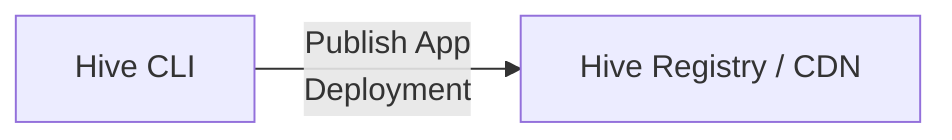
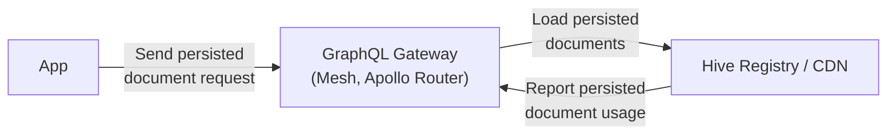

import NextImage from 'next/image'

# App Deployments

App deployments are a way to group and publish your GraphQL operations as a single app version to
the Hive Registry. This allows you to keep track of your different app versions, their operations
usage, and performance.

Making better decisions about:

- Which operations are being used by what app client version (mobile app, web app, etc.)
- Which team or developer is responsible for a specific operation and needs to be contacted for
  Schema change decissions



Furthermore, it allows you to leverage persisted documents (also knows as trusted documents or
persisted queries) on your GraphQL Gateway or server, which provides the following benefits:

- Reduce payload size of your GraphQL requests (reduce client bandwidth usage)
- Secure your GraphQL API by only allowing operations that are known and trusted by your Gateway



## Create an App Deployment

To create an app deployment, you need to have
[the Hive CLI installed](/docs/api-reference/cli#installation) and authenticated with your Hive
target, on which you want to deploy your app.

In addition you must have a JSON file containing a set of persisted documents generated by a tool
such as
[GraphQL Code Generator](https://the-guild.dev/graphql/codegen/plugins/presets/preset-client#persisted-documents).

```json filename="Example: persisted-operations.json"
{
  "d9a00ec0c1ce": "query UsageEstimationQuery($input: UsageEstimationInput!) { __typename usageEstimation(input: $input) { __typename operations } }",
  "b8d98e796421": "mutation GenerateStripeLinkMutation($selector: OrganizationSelectorInput!) { __typename generateStripePortalLink(selector: $selector) }"
}
```

These persisted documents define all the possible operations that your app can execute against your
GraphQL API.

As long as the app is using these persisted documents is active, any change of the GraphQL API that
alters the GraphQL schema as used by any of the persisted documents would break that specific app
version and therefore be an unsafe/breaking change.

Once these pre-requisites are met, you can create an app deployment by running the following
command:

```bash filename="Create an App Deployment via CLI"
hive app:create --name "my-app" --version "1.0.0" persisted-operations.json
```

The parameters `--name` and `--version` are mandatory and uniquily identify your app deployment.

| Parameter                | Description                                                   |
| ------------------------ | ------------------------------------------------------------- |
| `--name`                 | The name of the app deployment.                               |
| `--version`              | The version of the app deployment.                            |
| `persistedDocumentsFile` | The path to the JSON file containing the persisted documents. |

An app deployment is uniquely identified by the combination of the `name` and `version` parameters
for each target.

After creating an app deployment, it is in the pending state. That means you can view it on the Hive
App UI.

Navigate to the Target page on the Hive Dashboard and click on the **Apps** tab to see it.

import pendingAppImage from '../../../../public/docs/pages/features/app-deployments/pending-app.png'

<NextImage
  alt="Pending App Deployment"
  src={pendingAppImage}
  className="mt-10 max-w-2xl rounded-lg drop-shadow-md"
/>

By clicking on the app deployments name, you can navigate to the app deployment details page, where
you can see all the GraphQL operations that are uploaded as part of this app deployment.

import detailAppImage from '../../../../public/docs/pages/features/app-deployments/detail-app.png'

<NextImage
  alt="App Deployment Detail View"
  src={detailAppImage}
  className="mt-10 max-w-2xl rounded-lg drop-shadow-md"
/>

## Publish an App Deployment

A app deployment will be in the pending state until you publish it. By publishing the app
deployment, the persisted documents will be available via the Hive CDN and can be used by your
Gateway or GraphQL API for serving persisted documents to your app.

To publish an app deployment, you can run the following command. Make sure you utilize the same
`--name` and `--version` parameters as you used when creating the app deployment.

```bash filename="Publish an App Deployment via CLI"
hive app:publish --name "my-app" --version "1.0.0"
```

| Parameter   | Description                        |
| ----------- | ---------------------------------- |
| `--name`    | The name of the app deployment.    |
| `--version` | The version of the app deployment. |

After publishing the app deployment, the persisted documents, the status of the app deployment on
the Hive dashboard will change to **active**.

import activeAppImage from '../../../../public/docs/pages/features/app-deployments/active-app.png'

<NextImage
  alt="Active App Deployment"
  src={activeAppImage}
  className="mt-10 max-w-2xl rounded-lg drop-shadow-md"
/>

## Persisted Documents with GraphQL Yoga

TODO

## Persisted Documents with Apollo Server

TODO

## Persisted Documents with GraphQL Mesh

TODO

## Third-Party Integration of Persisted Documents (Raw Fetch from CDN)

Any published app deployment is available via the Hive CDN. You can fetch a the persisted documents
by doing a HTTP GET request.

```text filename="Fetch Persisted Document via HTTP"
GET https://cdn.graphql-hive.com/<target_id>/apps/<app_name>/<app_version>/<document_hash>
```

| Parameter       | Description                                                             |
| --------------- | ----------------------------------------------------------------------- |
| `target_id`     | The target ID of the Hive target where the app deployment is published. |
| `app_name`      | The name of the app deployment.                                         |
| `app_version`   | The version of the app deployment.                                      |
| `document_hash` | The hash of the persisted document.                                     |

Example curl request:

```bash filename="Example curl request"
curl \
  -L \
  -H 'X-Hive-CDN-Key: CDN_ACCESS_TOKEN' \
  https://cdn.graphql-hive.com/<target_id>/apps/<app_name>/<app_version>/<document_hash>
```

Expected responses.

| Response Status | Description                                                             |
| --------------- | ----------------------------------------------------------------------- |
| 200             | The persisted document was found and is returned in the response body.  |
| 404             | The persisted document does not exist.                                  |
| 401             | The request is unauthorized. A valid CDN access token must be provided. |
