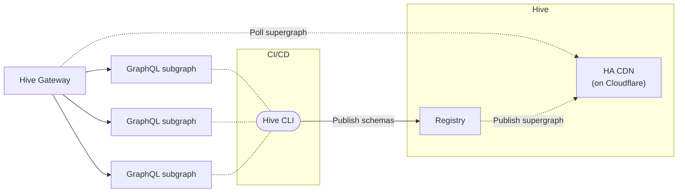

import NextImage from 'next/image'
import { Callout, Cards, FileTree, Steps, Tabs } from '@theguild/components'
import createAccessToken from '../../../../public/docs/pages/get-started/apollo-federation/create-access-token.png'
import createdAccessToken from '../../../../public/docs/pages/get-started/apollo-federation/created-access-token.png'

import registryTokenSettings from '../../../../public/docs/pages/get-started/apollo-federation/registry-token-settings.png'
import targetOverview from '../../../../public/docs/pages/get-started/apollo-federation/target-overview.png'
import cdnTokenImage from '../../../../public/docs/pages/guides/federation-cdn-token.png'
import federationExplorerImage from '../../../../public/docs/pages/guides/federation-explorer.png'
import federationHistoryImage from '../../../../public/docs/pages/guides/federation-history.png'
import federationSchemaImage from '../../../../public/docs/pages/guides/federation-schema.png'

import historyImage from '../../../../public/docs/pages/guides/history.png'
import tokenImage from '../../../../public/docs/pages/guides/token.png'

# Get started with Apollo Federation

Once you've created a Hive project of type **Apollo Federation**, you can start pushing your Apollo
Federation subgraph schemas to the Hive registry.

This guide will walk you through the basics of schema pushing, checking, and spin up the Hive
Gateway serving the federated GraphQL schema.

<Steps>

### Prerequisites

For this guide, we are going to use the following Subgraphs that we are going to publish to Hive.

> **Note**: If you want you can also use your own subgraphs instead of the ones we provide.

<FileTree>
  <FileTree.Folder name="subgraphs" defaultOpen>
    <FileTree.File name="products.graphql" />
    <FileTree.File name="reviews.graphql" />
  </FileTree.Folder>
</FileTree>

We provide the actual URLs for these running subgraphs, so we can later on send some real GraphQL
requests with our federation gateway.

- **Products**: https://federation-demo.theguild.workers.dev/products
- **Reviews**: https://federation-demo.theguild.workers.dev/reviews

Here's the GraphQL schema (SDL) for every subgraph we are going to publish to Hive. Save these to
files on your machine.

<Tabs items={['Products', 'Reviews']}>
  <Tabs.Tab>

```graphql filename="subgraphs/products.graphql"
enum CURRENCY_CODE {
  USD
}

type Department {
  category: ProductCategory
  url: String
}

type Money {
  amount: Float
  currencyCode: CURRENCY_CODE
}

type Price {
  cost: Money
  deal: Float
  dealSavings: Money
}

type Product @key(fields: "id") {
  id: ID!
  title: String
  url: String
  description: String
  price: Price
  salesRank(category: ProductCategory = ALL): Int
  salesRankOverall: Int
  salesRankInCategory: Int
  category: ProductCategory
  images(size: Int = 1000): [String]
  primaryImage(size: Int = 1000): String
}

enum ProductCategory {
  ALL
  GIFT_CARDS
  ELECTRONICS
  CAMERA_N_PHOTO
  VIDEO_GAMES
  BOOKS
  CLOTHING
}

extend type Query {
  bestSellers(category: ProductCategory = ALL): [Product]
  categories: [Department]
  product(id: ID!): Product
}
```

  </Tabs.Tab>
  <Tabs.Tab>

```graphql filename="subgraphs/reviews.graphql"
extend type Product @key(fields: "id") {
  id: ID! @external
  reviews: [Review]
  reviewSummary: ReviewSummary
}

type Review @key(fields: "id") {
  id: ID!
  rating: Float
  content: String
}

type ReviewSummary {
  totalReviews: Int
  averageRating: Float
}
```

  </Tabs.Tab>
</Tabs>

### Hive CLI setup

As you may have noticed, Hive has created three targets under your project: `development`,
`staging`, and `production`. Each of these targets represent a different environment. You can remove
or create new targets as needed, for modelling the different environments of your project.

<NextImage
  src={targetOverview}
  alt="Project overview showing the available targets"
  className="mt-10 max-w-xl rounded-lg drop-shadow-md"
/>

For this guide we will use the `development` target.

In order to publish our subgraph schemas to the schema registry, we first need to create an registry
access token with the necessary permissions for the Hive CLI.

Select the `development` target under your Hive project and then choose the **Settings** tab. On the
Settings screen, you can manage your target's settings and access tokens.

<NextImage
  src={registryTokenSettings}
  alt="Target settings for registry token management"
  className="mt-10 max-w-xl rounded-lg drop-shadow-md"
/>

Under the **Registry Access Tokens** section, click the **Create new registry token** button. Give
your access token a name and select **Read & Write** for the permissions:

<NextImage
  alt="Create Registry Token Form"
  src={createAccessToken}
  className="mt-10 max-w-xl rounded-lg drop-shadow-md"
/>

Click on **Generate Token** button and you should get your CLI token created, with permissions to
publish GraphQL schemas.

<NextImage
  alt="Created Registry Token Form"
  src={createdAccessToken}
  className="mt-10 max-w-xl rounded-lg drop-shadow-md"
/>

Make sure to copy your token and keep it safe. **You won't be able to see it again.**

### Publish subgraphs

Now that you have your access token, and you have the base schema defined, you can publish your
schema to the registry.

We'll start with the **Products** subgraph.

If you did not yet copy the contents of the `subgraphs/products.graphql` to a local file, you can do
so now.

Run the following command in your terminal, to publish your `subgraphs/products.graphql` to the
registry. Replace `<YOUR_TOKEN_HERE>` with the access token we just created.

<Tabs items={['Binary', 'NodeJS', 'Docker']}>

{/* Binary */}

<Tabs.Tab>

```bash
hive schema:publish \
  --registry.accessToken "<YOUR_TOKEN_HERE>" \
  --service="products" \
  --url="https://federation-demo.theguild.workers.dev/products" \
  --author "John Doe" \
  --commit "My first commit" \
  subgraphs/products.graphql
```

</Tabs.Tab>

{/* NodeJS */}

<Tabs.Tab>

```bash
npx hive schema:publish \
  --registry.accessToken "<YOUR_TOKEN_HERE>" \
  --service="products" \
  --url="https://federation-demo.theguild.workers.dev/products" \
  --author "John Doe" \
  --commit "My first commit" \
  subgraphs/products.graphql
```

</Tabs.Tab>

{/* Docker */}

<Tabs.Tab>

For Docker, we need to mount the subgraph schema file into the container.

```bash
docker run --name graphql-hive-cli --rm \
  -v $(pwd)/subgraphs/products.graphql/:/usr/src/app/subgraphs/products.graphql \
  ghcr.io/kamilkisiela/graphql-hive/cli \
  schema:publish \
  --registry.accessToken "<YOUR_TOKEN_HERE>" \
  --service="products" \
  --url="https://federation-demo.theguild.workers.dev/products" \
  --author "John Doe" \
  --commit "My first commit" \
  ./subgraphs/products.graphql
```

</Tabs.Tab>

</Tabs>

If everything goes well, you should see the following output, containing a link pointing you to the
schema version on the Hive dashboard.

```bash copy=false
✔ Published initial schema.
```

If you'll get to your target's page on Hive dashboard, you should see that it was updated with the
new schema you just published 🎉

<NextImage
  alt="Federation Schema Published"
  src={federationSchemaImage}
  className="mt-10 max-w-2xl rounded-lg drop-shadow-md"
/>

<Callout type="info">
  You should also check out the **Explorer** tab: you can see the schema you just published, and
  explore the API types, fields, and arguments.
</Callout>

Next, we will publish the **Reviews** subgraph schema to Hive. Again, let's start by copying the
schema to a local file.

Then, we run the following command in your terminal.

<Tabs items={['Binary', 'NodeJS', 'Docker']}>

{/* Binary */}

<Tabs.Tab>

```bash
hive schema:publish \
  --registry.accessToken YOUR_TOKEN_HERE \
  --service="reviews" \
  --url="https://federation-demo.theguild.workers.dev/reviews" \
  --author "John Doe" \
  --commit "My second commit" \
  subgraphs/reviews.graphql
```

</Tabs.Tab>

{/* NodeJS */}

<Tabs.Tab>

```bash
npx hive schema:publish \
  --registry.accessToken YOUR_TOKEN_HERE \
  --service="reviews" \
  --url="https://federation-demo.theguild.workers.dev/reviews" \
  --author "John Doe" \
  --commit "My second commit" \
  subgraphs/reviews.graphql
```

</Tabs.Tab>

{/* Docker */}

<Tabs.Tab>

For Docker, we need to mount the subgraph schema file into the container.

```bash
docker run --name graphql-hive-cli --rm \
  -v $(pwd)/subgraphs/reviews.graphql/:/usr/src/app/subgraphs/reviews.graphql \
  ghcr.io/kamilkisiela/graphql-hive/cli \
  schema:publish \
  --registry.accessToken "<YOUR_TOKEN_HERE>" \
  --service="reviews" \
  --url="https://federation-demo.theguild.workers.dev/reviews" \
  --author "John Doe" \
  --commit "My second commit" \
  ./subgraphs/reviews.graphql
```

</Tabs.Tab>

</Tabs>

If everything goes well, you should see the following output:

```bash copy=false
✔ Schema published
```

On your target's **Explorer** page now, you'll be able to see the schema of both subgraphs 🎉

<NextImage
  alt="Schema Explorer for Federation Projects"
  src={federationExplorerImage}
  className="mt-10 max-w-2xl rounded-lg drop-shadow-md"
/>

### Schema checks

Hive can perform several checks on your schema before publishing it to the registry. You can use
Hive CLI to run these check and find potential breaking changes or composition issues.

Usually, you would run these checks in your subgraphs CI pipeline, to ensure that your subgraph
schema integrates flawlessly with the other subgraphs in the federation project.

To see how schema checks works, let's make a small change to our schema. First, we'll start with a
non-breaking change - we'll add a new field to the `Review` type under the **Reviews** subgraph:

```graphql {11} filename="subgraphs/reviews.graphql"
extend type Product @key(fields: "id") {
  id: ID! @external
  reviews: [Review]
  reviewSummary: ReviewSummary
}

type Review @key(fields: "id") {
  id: ID!
  rating: Float
  content: String
  verified: Boolean # new field added
}

type ReviewSummary {
  totalReviews: Int
  averageRating: Float
}
```

Now, run the Hive CLI with the `schema:check` command and your modified `subgraphs/reviews.graphql`
file:

<Tabs items={['Binary', 'NodeJS', 'Docker']}>

{/* Binary */}

<Tabs.Tab>

```bash
hive schema:check \
  --registry.accessToken YOUR_TOKEN_HERE \
  --service="reviews" \
  --url="https://federation-demo.theguild.workers.dev/reviews" \
  subgraphs/reviews.graphql
```

</Tabs.Tab>

{/* NodeJS */}

<Tabs.Tab>

```bash
npx hive schema:check \
  --registry.accessToken YOUR_TOKEN_HERE \
  --service="reviews" \
  --url="https://federation-demo.theguild.workers.dev/reviews" \
  subgraphs/reviews.graphql
```

</Tabs.Tab>

{/* Docker */}

<Tabs.Tab>

For Docker, we need to mount the subgraph schema file into the container.

```bash
docker run --name graphql-hive-cli --rm \
  -v $(pwd)/subgraphs/reviews.graphql/:/usr/src/app/subgraphs/reviews.graphql \
  ghcr.io/kamilkisiela/graphql-hive/cli \
  schema:check \
  --registry.accessToken "<YOUR_TOKEN_HERE>" \
  --service="reviews" \
  --url="https://federation-demo.theguild.workers.dev/reviews" \
  ./subgraphs/reviews.graphql
```

</Tabs.Tab>

</Tabs>

You should see that Hive successfully detect the change you made, and exists with a `0` exit code,
meaning that the schema is compatible, valid and has no breaking changes:

```bash copy=false
ℹ Detected 1 change

- Field verified was added to object type Review
```

Now, are going to try introduce a breaking change. To do that, we'll rename an existing field in the
GraphQL schema of the **Reviews** subgraph:

```graphql {9} filename="subgraphs/reviews.graphql"
extend type Product @key(fields: "id") {
  id: ID! @external
  reviews: [Review]
  reviewSummary: ReviewSummary
}

type Review @key(fields: "id") {
  id: ID!
  averageRating: Float # renamed from "rating"
  content: String
}

type ReviewSummary {
  totalReviews: Int
  averageRating: Float
}
```

<Tabs items={['Binary', 'NodeJS', 'Docker']}>

{/* Binary */}

<Tabs.Tab>

```bash
hive schema:check \
  --registry.accessToken YOUR_TOKEN_HERE \
  --service="reviews" \
  --url="https://federation-demo.theguild.workers.dev/reviews" \
  subgraphs/reviews.graphql
```

</Tabs.Tab>

{/* NodeJS */}

<Tabs.Tab>

```bash
npx hive schema:check \
  --registry.accessToken YOUR_TOKEN_HERE \
  --service="reviews" \
  --url="https://federation-demo.theguild.workers.dev/reviews" \
  subgraphs/reviews.graphql
```

</Tabs.Tab>

{/* Docker */}

<Tabs.Tab>

For Docker, we need to mount the subgraph schema file into the container.

```bash
docker run --name graphql-hive-cli --rm \
  -v $(pwd)/subgraphs/reviews.graphql/:/usr/src/app/subgraphs/reviews.graphql \
  ghcr.io/kamilkisiela/graphql-hive/cli \
  schema:check \
  --registry.accessToken "<YOUR_TOKEN_HERE>" \
  --service="reviews" \
  --url="https://federation-demo.theguild.workers.dev/reviews" \
  ./subgraphs/reviews.graphql
```

</Tabs.Tab>

</Tabs>

In that case, you'll notice that Hive CLI exists with a `1` exit code, meaning that the schema has
breaking changes, and it's not compatible with the current schema in the registry:

```bash copy=false
✖ Detected 1 error

- Breaking Change: Field rating was removed from object type Review

ℹ Detected 2 changes

- Field rating was removed from object type Review
- Field averageRating was added to object type Review
```

In addition to detecting simple breaking changes, Hive is capable of detecting composability and
compatibility issues across your subgraphs. To see how it works, let's make a small change to our
schema.

We are going to add a conflict to the **Reviews** service. We are going to add a new field (`price`)
to the `Product` type, that conflicts with the `Products` type in the **Products** service.

```graphql {5} filename="subgraphs/reviews.graphql"
extend type Product @key(fields: "id") {
  id: ID! @external
  reviews: [Review]
  reviewSummary: ReviewSummary
  price: Int # new field added
}

type Review @key(fields: "id") {
  id: ID!
  rating: Float
  content: String
}

type ReviewSummary {
  totalReviews: Int
  averageRating: Float
}
```

Run the Hive CLI with the `schema:check` command again and the modified `subgraphs/reviews.graphql`
file:

<Tabs items={['Binary', 'NodeJS', 'Docker']}>

{/* Binary */}

<Tabs.Tab>

```bash
hive schema:check \
  --registry.accessToken YOUR_TOKEN_HERE \
  --service="reviews" \
  --url="https://federation-demo.theguild.workers.dev/reviews" \
  subgraphs/reviews.graphql
```

</Tabs.Tab>

{/* NodeJS */}

<Tabs.Tab>

```bash
npx hive schema:check \
  --registry.accessToken YOUR_TOKEN_HERE \
  --service="reviews" \
  --url="https://federation-demo.theguild.workers.dev/reviews" \
  subgraphs/reviews.graphql
```

</Tabs.Tab>

{/* Docker */}

<Tabs.Tab>

For Docker, we need to mount the subgraph schema file into the container.

```bash
docker run --name graphql-hive-cli --rm \
  -v $(pwd)/subgraphs/reviews.graphql/:/usr/src/app/subgraphs/reviews.graphql \
  ghcr.io/kamilkisiela/graphql-hive/cli \
  schema:check \
  --registry.accessToken "<YOUR_TOKEN_HERE>" \
  --service="reviews" \
  --url="https://federation-demo.theguild.workers.dev/reviews" \
  ./subgraphs/reviews.graphql
```

</Tabs.Tab>

</Tabs>

And now you can see that the schema check process has failed, due to conflicts and inconsistencies
between the schemas:

```bash copy=false
✖ Detected 2 errors

- Breaking Change: Field Product.price changed type from Price to Int
- [reviews] Product.price - Product.price already exists in the schema. It cannot also be defined in this type extension. If this is meant to be an external field, add the $(@external) directive. > Field

ℹ Detected 1 change

- Field Product.price changed type from Price to Int
```

As you can see schema checks can help you to catch potential issues before you publish your schema
to the registry.

Schema checks are usually integrated into the Continious Integration (CI) pipeline of your subgraph,
where schema publishes are made within the Continious Deployment (CD) pipeline.

### Hive Gateway

The next step to spin up our GraphQL gateway that uses the information published to the schema
registry for serving the composed GraphQL schema and delegating the GraphQL request to the
subgraphs.



#### CDN Access

The Hive schema registry publishes the supergraph (artifact of the composed schemas that contains
all the information about the subgraphs and fields available) to the high-availability CDN on
Cloudflare.

The federation gateway can poll the supergraph from the CDN and serve the composed GraphQL schema.

For accessing the supergraph, you need to get the CDN token from the Hive dashboard.

Navigate to your target's page on Hive's dashboard and click on the **Connect to CDN** button. You
will see a screen with instructions on how to obtain different types of artifacts from the CDN. For
this guide, you can pick the **Apollo Federation Supergraph** artifact.

<NextImage
  alt="CDN Token Form"
  src={cdnTokenImage}
  className="mt-10 max-w-2xl rounded-lg drop-shadow-md"
/>

Copy the URL and let's try to fetch your schema using `curl` (replace `YOUR_HIVE_CDN_TOKEN` with
your CDN token, and `CDN_ENDPOINT_HERE` with the endpoint you copied from Hive's dashboard):

```bash
curl -L -H "X-Hive-CDN-Key: YOUR_HIVE_CDN_TOKEN" CDN_ENDPOINT_HERE
```

You should see that Hive CDN returns the complete Supergraph as an output for that command.

#### Run the Gateway

Hive Gateway is the Federation Gateway that seamlessly integrates with the Hive registry. You can
run Hive Gateay either as a Docker image, binary or NPM package.

<Tabs items={['Docker', 'Node.js Package']}>
  {/* Docker */}
  <Tabs.Tab>

The Docker image for GraphQL Mesh is published to the GitHub docker registry. You can simply run the
following command to start a GraphQL Mesh gateway instance from your existing Hive target.

```sh
docker run --name hive-gateway -rm \
  ghcr.io/ardatan/mesh-serve supergraph \
  "<hive_cdn_endpoint>" \
  --hive-cdn-key "<hive_cdn_access_key>"
```

| Parameter               | Description                      |
| ----------------------- | -------------------------------- |
| `<hive_cdn_endpoint>`   | The endpoint of your Hive target |
| `<hive_cdn_access_key>` | The Hive CDN access key          |

  </Tabs.Tab>

{/* Node.js Package */}

  <Tabs.Tab>

The Mesh CLI is available as a Node.js package. You can install it using your favorite package
manager.

```sh npm2yarn
npm install @graphql-mesh/serve-cli
```

You can then run the Mesh CLI from your existing Hive target using the following command.

```sh filename="Run Mesh Gateway"
npx mesh-serve supergraph \
  "<hive_cdn_endpoint>" \
  --hive-cdn-key "<hive_cdn_access_key>"
```

| Parameter             | Description                      |
| --------------------- | -------------------------------- |
| `hive_cdn_endpoint`   | The endpoint of your Hive target |
| `hive_cdn_access_key` | The Hive CDN access key          |

  </Tabs.Tab>
</Tabs>

If you now navigate to `http://localhost:4000`, you should see the GraphQL Mesh page with
information about the supergraph and subgraphs.

import MeshLandingPageImage from '../../../../public/docs/pages/get-started/apollo-federation/mesh-landing-page.png'

<NextImage
  alt="GraphQL Mesh Landing Page"
  src={MeshLandingPageImage}
  className="mt-10 max-w-2xl rounded-lg drop-shadow-md"
/>

Now, if you navigate to `http://localhost:4000/graphql`, you should see the GrapihQL interface where
you can write and execute queries against the supergraph.

#### Usage reporting

Up next let's report the usage from our gateway to the registry, so we can see on the dashboard how
the API is being used.

For this, we simply provide a usage reporting token in addition to our CDN access token. For this
guide, we can simply re-use the registry token we already use for the CLI.

<Tabs items={['Docker', 'Node.js Package']}>
  {/* Docker */}
  <Tabs.Tab>

The Docker image for GraphQL Mesh is published to the GitHub docker registry. You can simply run the
following command to start a GraphQL Mesh gateway instance from your existing Hive target.

```sh
docker run --name hive-gateway -rm \
  ghcr.io/ardatan/mesh-serve supergraph \
  "<hive_cdn_endpoint>" \
  --hive-cdn-key "<hive_cdn_access_key>" \
  --hive-registry-token "<hive_registry_token>"
```

| Parameter               | Description                                 |
| ----------------------- | ------------------------------------------- |
| `<hive_cdn_endpoint>`   | The endpoint of your Hive target            |
| `<hive_cdn_access_key>` | The Hive CDN access key                     |
| `<hive_registry_token>` | The Hive registry token for usage reporting |

  </Tabs.Tab>

{/* Node.js Package */}

  <Tabs.Tab>

```sh filename="Run Mesh Gateway with registry token"
npx mesh-serve supergraph \
  "<hive_cdn_endpoint>" \
  --hive-cdn-key "<hive_cdn_access_key>" \
  --hive-registry-token "<hive_registry_token>"
```

| Parameter               | Description                                 |
| ----------------------- | ------------------------------------------- |
| `<hive_cdn_endpoint>`   | The endpoint of your Hive target            |
| `<hive_cdn_access_key>` | The Hive CDN access key                     |
| `<hive_registry_token>` | The Hive registry token for usage reporting |

  </Tabs.Tab>
</Tabs>

After starting the gateway with the usage reporting token, we can no execute some queries using the
gateways built-in GraphiQL interface.

```graphql
{
  topProducts {
    upc
    name
    price
  }
}
```

[Execute Query on Hive Gateway GraphiQL](http://localhost:4000/graphql?query=%7B%0A++topProducts+%7B%0A++++upc%0A++++name%0A++++price%0A++%7D%0A%7D)

After executing the query, a few times, let's switch back to the Hive dashboard and navigate to the
insights page.

{/* TODO: PICTURE */}

Here we can now see the GraphQL operations from our Gateway being reported to the registry.

### Next Steps

Congratulations on publishing your first subgraph schemas to the Hive schema registry, composing
your supergraph, spinning up your own Federation Gateway serving the unified GraphQL schema and
reporting the usage data!

From here you can continue to explore the Hive dashboard, or dive deeper into the documentation to
learn about all the features of the Hive platform.

</Steps>
