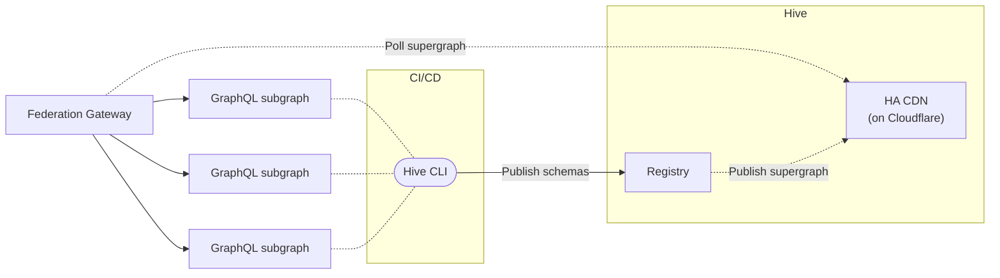

import NextImage from 'next/image'
import { Callout, Cards, FileTree, Steps, Tabs } from '@theguild/components'
import cdnTokenImage from '../../../../public/docs/pages/guides/federation-cdn-token.png'
import federationExplorerImage from '../../../../public/docs/pages/guides/federation-explorer.png'
import federationHistoryImage from '../../../../public/docs/pages/guides/federation-history.png'
import federationSchemaImage from '../../../../public/docs/pages/guides/federation-schema.png'
import historyImage from '../../../../public/docs/pages/guides/history.png'
import tokenImage from '../../../../public/docs/pages/guides/token.png'

# Guide: Apollo Federation Project

Once you've created a Hive project of type **Apollo Federation**, you can simply push your GraphQL
schema to the registry. This guide will guide you through the basics of schema pushing, checking and
fetching of the Supergraph SDL to your Apollo Gateway / Router.

This guide is going to use the
[Apollo Federation v1 specification](https://www.apollographql.com/docs/federation/v1/) with Hive.

<Callout type="info" emoji="👩‍🔬">
**Native Apollo Federation v2 support is coming soon**

We're currently developing a new functionality that enables you to utilize Apollo Federation v2
seamlessly with Hive Cloud, **eliminating the need for you to manage your own composition server**.

To gain early access to this feature, submit a support ticket (_🛟 Support_ in user menu), and we'll
activate it for your project.

</Callout>

<Callout type="warning">
  
**Apollo Federation v2 Support in Hive Cloud**

As part of the Apollo Federation v2 release,
[Apollo changed their product license from MIT to Elastic License v2](https://www.apollographql.com/blog/announcement/moving-apollo-federation-2-to-the-elastic-license-v2/).
This means that Hive Cloud cannot use Apollo Federation v2 libraries directly, or offer Cloud
services that uses the new properitey libraries internally.

**To use Apollo Federation v2 with your Hive project, you have to run your own composition server
and connect it to Hive.
[We have a guide on how to do this here](/docs/management/external-schema-composition).**

</Callout>

<Steps>

### Subgraphs

For this guide, we are going to use the following Subgraphs:

<FileTree>
  <FileTree.Folder name="subgraphs" defaultOpen>
    <FileTree.File name="products.graphql" />
    <FileTree.File name="reviews.graphql" />
  </FileTree.Folder>
</FileTree>

Here's the GraphQL schema (SDL) for every subgraph we are going to publish to Hive:

<Tabs items={['Products', 'Reviews']}>
  <Tabs.Tab>

```graphql filename="subgraphs/products.graphql"
enum CURRENCY_CODE {
  USD
}

type Department {
  category: ProductCategory
  url: String
}

type Money {
  amount: Float
  currencyCode: CURRENCY_CODE
}

type Price {
  cost: Money
  deal: Float
  dealSavings: Money
}

type Product @key(fields: "id") {
  id: ID!
  title: String
  url: String
  description: String
  price: Price
  salesRank(category: ProductCategory = ALL): Int
  salesRankOverall: Int
  salesRankInCategory: Int
  category: ProductCategory
  images(size: Int = 1000): [String]
  primaryImage(size: Int = 1000): String
}

enum ProductCategory {
  ALL
  GIFT_CARDS
  ELECTRONICS
  CAMERA_N_PHOTO
  VIDEO_GAMES
  BOOKS
  CLOTHING
}

extend type Query {
  bestSellers(category: ProductCategory = ALL): [Product]
  categories: [Department]
  product(id: ID!): Product
}
```

  </Tabs.Tab>
  <Tabs.Tab>

```graphql filename="subgraphs/reviews.graphql"
extend type Product @key(fields: "id") {
  id: ID! @external
  reviews: [Review]
  reviewSummary: ReviewSummary
}

type Review @key(fields: "id") {
  id: ID!
  rating: Float
  content: String
}

type ReviewSummary {
  totalReviews: Int
  averageRating: Float
}
```

  </Tabs.Tab>
</Tabs>

### Hive CLI Access Token

As you may have noticed, Hive has created three targets under your project: `development`,
`staging`, and `production`. This guide will use the `development` target to explore the features
Hive offers.

To begin, select the `development` target under your Hive project and then choose the **Settings**
tab. On the Settings screen, you can manage your target's settings and access tokens.

Under the **Registry Access Tokens** section, click the **Generate new token** button. Give your
access token a name and select **Schema Check & Push** from the list of token presets:

<NextImage
  alt="Create Registry Token Form"
  src={tokenImage}
  className="mt-10 max-w-md rounded-lg drop-shadow-md"
/>

Click on **Generate Token** button and you should get your CLI token created, with permissions to
publish GraphQL schemas.

Make sure to copy your token and keep it safe. **You won't be able to see it again.**

<Callout type="info">
  **Note:** You can create multiple tokens with different permissions for different use cases.
</Callout>

### Publish your schemas

Now that you have your access token, and you have the base schema defined, you can publish your
schema to the registry.

We'll start with the **Products** subgraph.

Run the following command in your terminal, to publish your `subgraphs/products.graphql` to the
registry (replace `YOUR_TOKEN_HERE` with the token you have just created):

```bash
hive schema:publish \
  --registry.accessToken YOUR_TOKEN_HERE \
  --service="products" \
  --url="http://fake.com/products/graphql" \
  --author "Me" \
  --commit "First" \
  subgraphs/products.graphql
```

<Callout type="info">
  If you are running under a NodeJS project, make sure to include the `npx`, `yarn` or `pnpm` prefix
  to the command.
</Callout>

If everything goes well, you should see the following output:

```bash copy=false
✔ Published initial schema.
```

If you'll get to your target's page on Hive dashboard, you should see that it was updated with the
new schema you just published 🎉

<NextImage
  alt="Federation Schema Published"
  src={federationSchemaImage}
  className="mt-10 max-w-2xl rounded-lg drop-shadow-md"
/>

<Callout type="info">
  You should also check out the **Explorer** tab: you can see the schema you just published, and
  explore the API types, fields, and arguments.
</Callout>

Now, let's publish the **Reviews** subgraph schema to Hive:

```bash
hive schema:publish \
  --registry.accessToken YOUR_TOKEN_HERE \
  --service="reviews" \
  --url="http://fake.com/reviews/graphql" \
  --author "Me" \
  --commit "Second" \
  subgraphs/reviews.graphql
```

If everything goes well, you should see the following output:

```bash copy=false
✔ Schema published
```

On your target's **Explorer** page now, you'll be able to see the schema of both subgraphs 🎉

<NextImage
  alt="Schema Explorer for Federation Projects"
  src={federationExplorerImage}
  className="mt-10 max-w-2xl rounded-lg drop-shadow-md"
/>

### Schema Checks

Hive can perform several checks on your schema before publishing it to the registry. You can use
Hive CLI to run these check and find potential breaking changes, and potential composition issues
when a Apollo Federation project is used.

To see how schema checks works, let's make a small change to our schema. First, we'll start with a
non-breaking change - we'll add a new field to the `Review` type under the **Reviews** subgraph:

```graphql {11} filename="subgraphs/reviews.graphql"
extend type Product @key(fields: "id") {
  id: ID! @external
  reviews: [Review]
  reviewSummary: ReviewSummary
}

type Review @key(fields: "id") {
  id: ID!
  rating: Float
  content: String
  verified: Boolean # new field added
}

type ReviewSummary {
  totalReviews: Int
  averageRating: Float
}
```

Now, run the Hive CLI with the `schema:check` command and your modified `subgraphs/reviews.graphql`
file:

```bash
hive schema:check \
  --registry.accessToken YOUR_TOKEN_HERE \
  --service="reviews" \
  subgraphs/reviews.graphql
```

You should see that Hive successfully detect the change you made, and exists with a `0` exit code,
meaning that the schema is compatible, valid and has no breaking changes:

```bash copy=false
ℹ Detected 1 change

- Field verified was added to object type Review
```

Now, are going to try introduce a breaking change. To do that, we'll rename an existing field in the
GraphQL schema of the **Reviews** subgraph:

```graphql {9} filename="subgraphs/reviews.graphql"
extend type Product @key(fields: "id") {
  id: ID! @external
  reviews: [Review]
  reviewSummary: ReviewSummary
}

type Review @key(fields: "id") {
  id: ID!
  averageRating: Float # renamed from "rating"
  content: String
}

type ReviewSummary {
  totalReviews: Int
  averageRating: Float
}
```

```bash
hive schema:check \
  --registry.accessToken YOUR_TOKEN_HERE \
  --service="reviews" \
  subgraphs/reviews.graphql
```

In that case, you'll notice that Hive CLI exists with a `1` exit code, meaning that the schema has
breaking changes, and it's not compatible with the current schema in the registry:

```bash copy=false
✖ Detected 1 error

- Breaking Change: Field rating was removed from object type Review

ℹ Detected 2 changes

- Field rating was removed from object type Review
- Field averageRating was added to object type Review
```

In addition to detecting simple breaking changes, Hive is capable of detecting composability and
compatibility issues across your subgraphs. To see how it works, let's make a small change to our
schema.

We are going to add a conflict to the **Reviews** service. We are going to add a new field (`price`)
to the `Product` type, that conflicts with the `Products` type in the **Products** service.

```graphql {5} filename="subgraphs/reviews.graphql"
extend type Product @key(fields: "id") {
  id: ID! @external
  reviews: [Review]
  reviewSummary: ReviewSummary
  price: Int # new field added
}

type Review @key(fields: "id") {
  id: ID!
  rating: Float
  content: String
}

type ReviewSummary {
  totalReviews: Int
  averageRating: Float
}
```

Run the Hive CLI with the `schema:check` command again and the modified `subgraphs/reviews.graphql`
file:

```bash
hive schema:check \
  --registry.accessToken YOUR_TOKEN_HERE \
  --service="reviews" \
  subgraphs/reviews.graphql
```

And now you can see that the schema check process has failed, due to conflicts and inconsistencies
between the schemas:

```bash copy=false
✖ Detected 2 errors

- Breaking Change: Field Product.price changed type from Price to Int
- [reviews] Product.price - Product.price already exists in the schema. It cannot also be defined in this type extension. If this is meant to be an external field, add the $(@external) directive. > Field

ℹ Detected 1 change

- Field Product.price changed type from Price to Int
```

### Evolve your schema

Now that you have your schema published, you can evolve it over time. You can add new types, fields,
and implement new capabilities for your consumers.

Let's make a valid change in our schema and push it again to the registry:

```graphql {11} filename="subgraphs/reviews.graphql"
extend type Product @key(fields: "id") {
  id: ID! @external
  reviews: [Review]
  reviewSummary: ReviewSummary
}

type Review @key(fields: "id") {
  id: ID!
  rating: Float
  content: String
  verified: Boolean # new field added
}

type ReviewSummary {
  totalReviews: Int
  averageRating: Float
}
```

And publish it to Hive:

```bash
hive schema:publish \
  --registry.accessToken YOUR_TOKEN_HERE \
  --service="reviews" \
  --url="http://fake.com/reviews/graphql" \
  --author "Me" \
  --commit "Third" \
  subgraphs/reviews.graphql
```

You should see now that Hive accepted your published schema and updated the registry:

```bash copy=false
✔ Schema published
```

It's a good timing to check the **History** tab of your Hive target. You should see that a new
schema is published now, and you can see the changes you made:

<NextImage
  alt="Schema History"
  src={federationHistoryImage}
  className="mt-10 max-w-2xl rounded-lg drop-shadow-md"
/>

### Fetch your Supergraph

Now that your GraphQL schema is stored in the Hive registry, you can access and fetch it through
Hive's CDN (Content Delivery Network).

The Hive Cloud service leverages the
[CloudFlare Global Network](https://www.cloudflare.com/network/) to deliver your GraphQL schema and
schema metadata. This means that your schema will be available from the nearest location to your
GraphQL gateway, with 100% uptime, regardless of Hive's status. This ensures that everything
required for your GraphQL API is always available, and reduces the risk of depending on Hive as a
single point of failure.
[You can read more about Hive's CDN here](/docs/features/high-availability-cdn).

To get started with Hive's CDN access, you'll need to create a CDN token from your target's
**Settings** page. You'll see a separate section for managing and creating CDN tokens, called **CDN
Access Token**.

Click on **Create new CDN Token** to create a new CDN token. Describe your token with an alias, and
click **Create**. Please store this access token securely. **You will not be able to see it again.**

<Callout type="info">
**Why are Registry and CDN tokens different?**

We use a separate, externally managed storage to manage CDN tokens to ensure high availability of
your schemas. This approach ensures that your GraphQL schemas are fully secured and highly
available. CDN tokens are read-only and can only fetch schemas from the CDN. They do not have
permissions to perform any other action on your Hive organization.

</Callout>

To use your access token, go to your target's page on Hive's dashboard and click on the **Connect to
CDN** button. You will see a screen with instructions on how to obtain different types of artifacts
from the CDN. For this guide, you can pick the **Apollo Federation Supergraph** artifact.

<NextImage
  alt="CDN Token Form"
  src={cdnTokenImage}
  className="mt-10 max-w-2xl rounded-lg drop-shadow-md"
/>

Copy the URL and let's try to fetch your schema using `curl` (replace `YOUR_HIVE_CDN_TOKEN` with
your CDN token, and `CDN_ENDPOINT_HERE` with the endpoint you copied from Hive's dashboard):

```bash
curl -L -H "X-Hive-CDN-Key: YOUR_HIVE_CDN_TOKEN" CDN_ENDPOINT_HERE
```

You should see that Hive CDN returns the complete Supergraph as an output for that command.

### GraphQL Gateway

The next step is to use real subgraphs and a GraphQL gateway that routes GraphQL requests to your
subgraphs.



For an Apollo Federation gateway you may use **Apollo Gateway** (JS) or **Apollo Router** (Rust)
depending on your needs. You can use the following guides to deploy a gateway based on your
technical preference:

<Cards>
  <Cards.Card arrow title="Apollo Gateway (JS)" href="/docs/integrations/apollo-gateway" />
  <Cards.Card arrow title="Apollo Router (Rust)" href="/docs/integrations/apollo-router" />
</Cards>

### Next Steps

Now that you use the basic functionality of Hive as a schema registry, we recommend following other
powerful features of Hive:

- [External Schema Compostion for Apollo Federation v2](/docs/management/external-schema-composition)
- [Usage Reporting and Monintoring](/docs/features/usage-reporting)
- [Conditional Breaking Changes](/docs/management/targets#conditional-breaking-changes)
- [Alerts and Notifications](/docs/management/projects#alerts-and-notifications)
- [CI/CD Integration](/docs/integrations/ci-cd)
- [Schema Policies](/docs/features/schema-policy)

</Steps>
