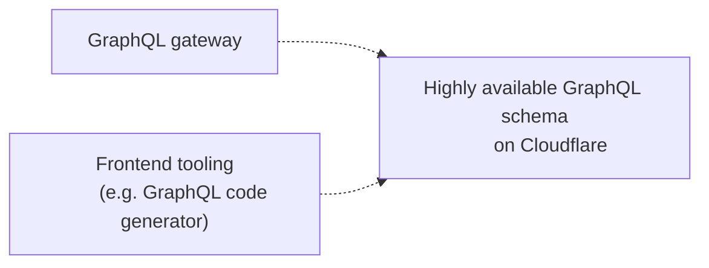
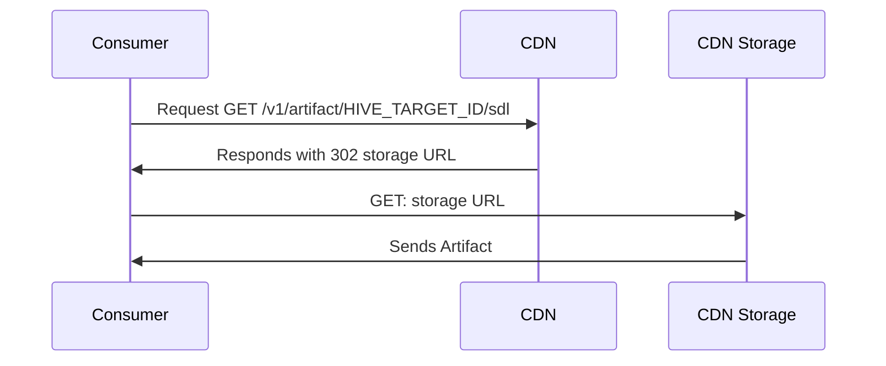

import NextImage from 'next/image'
import { Callout } from '@theguild/components'
import cdnTokenImage from '../../../public/docs/pages/guides/cdn_token.png'

# High-Availability CDN

The Hive Cloud service leverages the
[CloudFlare Global Network](https://www.cloudflare.com/network/) to deliver your GraphQL schema and
schema metadata. This means that your schema will be available from the nearest location to your
GraphQL gateway, with [amazing uptime](https://www.cloudflare.com/business-sla/), regardless of
Hive's status. This ensures that everything required for your GraphQL API and tooling around it is
always available, and reduces the risk of depending on Hive as a single point of failure.



<Callout type="info">
  The High-Availability CDN is available only in Hive Cloud, and not available for the self-hosted
  version. For the self-hosted version you can expose the CDN route handlers via the Hive API.
  [Learn more](/docs/self-hosting/cdn-artifacts).
</Callout>

Currently you can access the single services, merged schema, supergraph and metadata (e.g. GraphQL
Mesh artifacts) via the CDN.

## CDN Access Tokens

To get started with Hive's CDN access, you'll need to create a CDN token for your target (see
[Target & Tokens](/docs/management/targets#cdn-access-tokens)).

<Callout>
  The CDN access token is considered a secret and should not be shared with anyone else. If a CDN
  access token is compromised, you can [revoke it from the target's Settings
  page](/docs/management/targets#revoking-a-cdn-access-token), and create a new token.
</Callout>

To use your CDN access token, go to your target's page on Hive's dashboard and click on the
**Connect to CDN** button.

<NextImage
  alt="CDN Token Form"
  src={cdnTokenImage}
  className="mt-10 max-w-2xl rounded-lg drop-shadow-md"
/>

## Artifacts stored in the CDN

You can access the GraphQL schema (SDL), services information (for both Schema-Stitching and Apollo
Federeation), Supergraph (for Apollo Federation) and Hive schema metadata via the CDN.

### GraphQL schema (SDL)

```bash
curl -v -H 'X-Hive-CDN-Key: CDN_ACCESS_TOKEN' \
  "https://cdn.graphql-hive.com/artifacts/v1/TARGET_ID/sdl"
```

### List of Services

```bash
curl -v -H 'X-Hive-CDN-Key: CDN_ACCESS_TOKEN' \
  "https://cdn.graphql-hive.com/artifacts/v1/TARGET_ID/services"
```

### Supergraph

<Callout>This artifact is only available for Apollo Federation projects.</Callout>

```bash
curl -v -H 'X-Hive-CDN-Key: CDN_ACCESS_TOKEN' \
  "https://cdn.graphql-hive.com/artifacts/v1/TARGET_ID/supergraph"
```

Further reading:

- [Integrating Hive CDN with Apollo Gateway](/docs/other-integrations/apollo-gateway)
- [Integrating Hive CDN with Apollo Router](/docs/other-integrations/apollo-router)
- [Get started with Hive and Apollo Fededation](/docs/get-started/apollo-federation)

### Hive Metadata

<Callout>This artifact is only available for Single and Schema-Stitching projects.</Callout>

```bash
curl -v -H 'X-Hive-CDN-Key: CDN_ACCESS_TOKEN' \
  "https://cdn.graphql-hive.com/artifacts/v1/TARGET_ID/metadata"
```

## How it works

Every time you successfully publish a GraphQL schema to the schema registry, Hive replicated the
schema and its metadata, and push it to the CDN to make it globally available through a secured
channel.

The artifacts are stored on an S3 compatible bucket. In order to load them, you need to send a `GET`
request to the CDN URL with the `X-Hive-CDN-Key` header.



Here's an example for

```bash copy=false filename="Example curl Request for accessing SDL"
curl -v -H 'X-Hive-CDN-Key: CDN_ACCESS_TOKEN' \
  https://cdn.graphql-hive.com/v1/HIVE_TARGET_ID/sdl

/artifacts/v1/c7ce447c-f5e6-4f13-87b8-d3051ba3fc45/sdl > GET
302 < Found
location < Header: https://6d5bc18cd8d13babe7ed321adba3d8ae.r2.cloudflarestorage.com/artifacts/c7ce447c-f5e6-4f13-87b8-d3051ba3fc45/sdl
Found.
```

In case the request was successfull (correct authorization header was provided and the artifact
exists). The CDN will respond with status code `302`. You can now access the artifact via the
provided URL in the `location` header. The link is valid for 60 seconds.

Adding `-L` to the `curl` command will follow the redirect and return the artifact itself:

```bash copy=false filename="Example curl Request for accessing SDL"
curl -L -H 'X-Hive-CDN-Key: CDN_ACCESS_TOKEN' \
  https://cdn.graphql-hive.com/v1/HIVE_TARGET_ID/sdl

type Query {
ping: String
}%
```

## CDN Caching

The CDN service accepts the [`ETag`](https://developer.mozilla.org/en-US/docs/Web/HTTP/Headers/ETag)
and [`If-None-Match`](https://developer.mozilla.org/en-US/docs/Web/HTTP/Headers/If-None-Match)
headers.

Every successful response from the CDN service (`200 OK`) contains the `ETag` header with a
checksum. If you send the same checksum in the `If-None-Match` header, the CDN service will return
`304 Not Modified`, but only if the data hasn't changed. If the data has changed, the CDN service
will return `200 OK` with the new data and new `ETag` header.

Using `ETag` and `If-None-Match` helps to prevent unnecessary data transfer.

The [`@graphql-hive/core`](/docs/api-reference/client#javascript--nodejs-client) package uses this
feature to save bandwidth and improve performance.

## CDN Hosts

Your company might have strict rules for accessing external services. In case you need to allow-list
hosts for the CDN service, you can use the following list.

```txt
cdn.graphql-hive.com
6d5bc18cd8d13babe7ed321adba3d8ae.r2.cloudflarestorage.com
```
