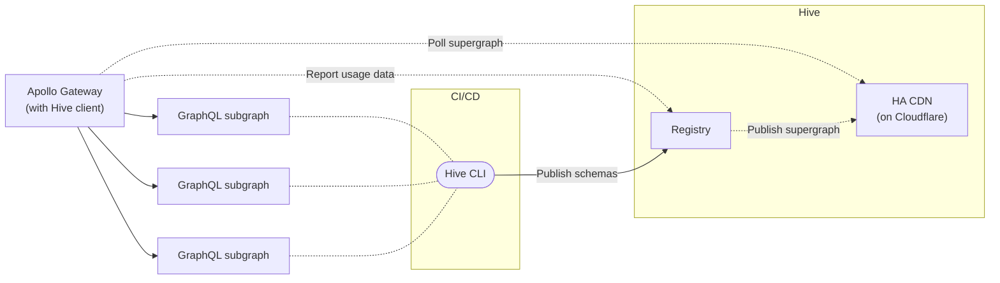

import { Callout } from '@theguild/components'

## Apollo Gateway

[Apollo-Gateway](https://www.apollographql.com/docs/federation/v1/gateway/) is the JavaScript Apollo
Federation gateway runtime.

Hive integrates with Apollo Gateway to provide the Supergraph schema information required for
running a federated graph gateway, once all schemas are published.



## Installation

```sh npm2yarn
npm i @graphql-hive/client
```

<Callout type="info">
  We recommend installing Hive Client package as a direct dependency of your project, because it
  includes a runtime to send usage reports and schemas to Hive registry.
</Callout>

The `@graphql-hive/client` package exports a utility function called `createSupergraphManager` that
fetches the Supergraph schema from the Hive's CDN, and also a
[Apollo-Server plugin](https://www.apollographql.com/docs/apollo-server/) for reporting operations.

## Supergraph SDL from the CDN

Once you have all services schemas pushed to Hive, and available in the CDN, you can
[create a CDN Access Token and gain access to the CDN endpoint](/docs/features/high-availability-cdn#cdn-access-tokens).

With the endpoint and CDN access token available, you can integrate Hive with Apollo Gateway:

```ts
import { ApolloGateway } from '@apollo/gateway'
import { ApolloServer } from '@apollo/server'
import { startStandaloneServer } from '@apollo/server/standalone'
import { createSupergraphManager } from '@graphql-hive/client'

const gateway = new ApolloGateway({
  // Apollo Gateway will fetch Supergraph from Hive CDN
  supergraphSdl: createSupergraphManager({
    endpoint: 'HIVE_CDN_ENDPOINT',
    key: 'HIVE_CDN_KEY',
    pollIntervalInMs: 15_000
  })
})

const server = new ApolloServer({ gateway })

const { url } = await startStandaloneServer({ server })
console.log(`🚀 Server ready at ${url}`)
```

### Usage Reporting

<Callout>
  For more configuration options, such as sampling, client name and version reporting, please refer
  to the [Hive client configuration](/docs/api-reference/client#configuration) reference.
</Callout>

To enable Usage Reporting with your Apollo Gateway, you can use the Hive plugin for Apollo Server:

```ts
import { ApolloGateway } from '@apollo/gateway'
import { ApolloServer } from '@apollo/server'
import { startStandaloneServer } from '@apollo/server/standalone'
import { createSupergraphManager, hiveApollo } from '@graphql-hive/client'

const gateway = new ApolloGateway({
  // Apollo Gateway will fetch Supergraph from Hive CDN
  supergraphSdl: createSupergraphManager({
    endpoint: process.env.HIVE_CDN_ENDPOINT,
    key: process.env.HIVE_CDN_KEY,
    pollIntervalInMs: 15_000
  })
})

const server = new ApolloServer({
  gateway,
  plugins: [
    hiveApollo({
      enabled: true,
      token: 'YOUR-TOKEN',
      usage: true // add this one to report usage and operations
    })
  ]
})

const { url } = await startStandaloneServer({ server })
console.log(`🚀 Server ready at ${url}`)
```

<Callout>
  The `HIVE_CDN_ENDPOINT` variable should **NOT** include any artifact suffix (for example,
  `/supergraph`), it should be in the following format:
  `https://cdn.graphql-hive.com/artifacts/v1/TARGET_ID`
</Callout>

## Additional Resources

- [Get started with Apollo Federation and Hive guide](/docs/get-started/apollo-federation)
- [Apollo Gateway documentation](https://www.apollographql.com/docs/federation/v1/gateway/)
- [Apollo Server](https://www.apollographql.com/docs/apollo-server/)
- [`@graphql-hive/client` source code](https://github.com/kamilkisiela/graphql-hive/tree/main/packages/libraries/client)
- [`HivePluginOptions` configuration reference](https://github.com/kamilkisiela/graphql-hive/blob/main/packages/libraries/client/src/internal/types.ts#LL40C29-L40C29)
