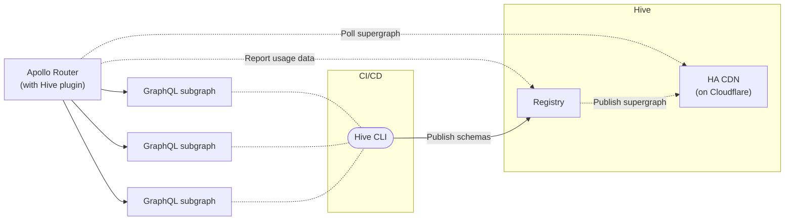

import { Callout, Tabs } from '@theguild/components'

# Apollo Router

[Apollo Router](https://www.apollographql.com/docs/router/) is the Rust implementation of the Apollo
Federation runtime.

Hive ships a custom build of Apollo Gateway,
[because that's how native extensions works](https://www.apollographql.com/docs/router/customizations/native).

With the custom build, Apollo Gateway will poll the supergraph from the high availability CDN to
ensure production deployments without interruptions.



## Installation

Make sure you have
[published all your subgraph schemas to your Federation target](/docs/get-started/apollo-federation#publish-your-schemas)
on the Hive registry. Once you have all subgraph schemas published and the subgraphs can be
composed, the latest valid supergraph is always available via the CDN.

You also need to
[create a CDN Access Token](/docs/features/high-availability-cdn#cdn-access-tokens), that will be
used for authenticating the supergraph polling from the CDN.

<Tabs items={['Binary', 'Docker', 'Custom']}>
  <Tabs.Tab>
    Download Apollo Router for Linux (`x86_64`), MacOS (`x86_64`) or Windows (`x86_64`):

    ```bash
    curl -fsSL https://graphql-hive.com/apollo-router-download.sh | bash
    ```

    Start the router:

    ```bash
    HIVE_CDN_ENDPOINT="..." \ # The endpoint of your CDN access token
    HIVE_CDN_KEY="..." \ # The CDN access token
      ./router
    ```

  </Tabs.Tab>
  <Tabs.Tab>
      Running Apollo Router with Hive's Schema Registry:

      ```bash
      docker run -p 4000:4000 \
        --env HIVE_CDN_ENDPOINT="..." \ # The endpoint of your CDN access token
        --env HIVE_CDN_KEY="..." \ # The CDN access token
        --rm \
        ghcr.io/kamilkisiela/graphql-hive/apollo-router:latest
      ```

      Passing command-line arguments:

      ```bash
      docker run -p 4000:4000 \
        --env HIVE_CDN_ENDPOINT="..." \ # The endpoint of your CDN access token
        --env HIVE_CDN_KEY="..." \ # The CDN access token
        --rm \
        ghcr.io/kamilkisiela/graphql-hive/apollo-router:latest --log debug
      ```

  </Tabs.Tab>

  <Tabs.Tab>
    Creating a custom Apollo Router binary requires compiling it from source.
    To setup a project, please follow ["Create a new project"](https://www.apollographql.com/docs/router/customizations/custom-binary/#1-create-a-new-project) section of "Creating a custom Apollo Router binary" guide.

    Once your project is ready, update `Cargo.toml` file with the following dependencies:

    ```toml filename="Cargo.toml"
    graphql-hive-router = { git = "https://github.com/kamilkisiela/graphql-hive", branch = "main" }
    ```

    Next, update `src/main.rs` file with the following content to add GraphQL Hive:

    ```diff filename="src/main.rs"
      mod plugins;

      use anyhow::Result;
    + use graphql_hive_router::registry;

      fn main() -> Result<()> {
    -   apollo_router::main()
    +   match registry::HiveRegistry::new(None).and(apollo_router::main()) {
    +     Ok(_) => {}
    +     Err(e) => {
    +         eprintln!("{}", e);
    +         std::process::exit(1);
    +     }
    +   }
      }
    ```

    Finally, [build the binary](https://www.apollographql.com/docs/router/customizations/custom-binary/#2-compile-the-router) and [run it](https://www.apollographql.com/docs/router/customizations/custom-binary/#3-run-the-compiled-binary) using `HIVE_CDN_ENDPOINT` and `HIVE_CDN_KEY` environment variables.

    In case of any issues, please refer to the [official guide](https://www.apollographql.com/docs/router/customizations/custom-binary/) or [open an issue](https://github.com/kamilkisiela/graphql-hive/issues/new) in GraphQL Hive repository.

  </Tabs.Tab>
</Tabs>

## Configuration

- `HIVE_CDN_ENDPOINT` - the endpoint Hive generated for you in the previous step
- `HIVE_CDN_KEY` - the access key
- `HIVE_CDN_POLL_INTERVAL` - polling interval (default is 10 seconds)
- `HIVE_CDN_ACCEPT_INVALID_CERTS` - accepts invalid SSL certificates (default is `false`)
- `HIVE_REGISTRY_LOG` - defines the log level for the registry (default is `INFO`)
- `HIVE_CDN_SCHEMA_FILE_PATH` - where to download the supergraph schema (default is
  `./supergraph-schema.graphql`)

<Callout>
  The `HIVE_CDN_ENDPOINT` variable should not include any artifact suffix (for example,
  `/supergraph`), it should be in the following format:
  `https://cdn.graphql-hive.com/artifacts/v1/TARGET_ID`
</Callout>

## Usage Reporting

You can send usage reporting to Hive registry by enabling `hive.usage` plugin in the config file
(`router.yaml`).

### Configuration

- `HIVE_TOKEN` - Your 'Registry Access Token' as configured in hive For self hosted Hive:
- `HIVE_ENDPOINT` - The usage endpoint (defaults to https://app.graphql-hive.com/usage)

<Tabs items={['Binary', 'Docker', 'Custom']}>
  <Tabs.Tab>
    Start the router:

    ```bash
    HIVE_TOKEN="..." \
    HIVE_CDN_ENDPOINT="..." \
    HIVE_CDN_KEY="..." \
      ./router --config router.yaml
    ```

  </Tabs.Tab>
  <Tabs.Tab>
      Running Apollo Router with Hive's Schema Registry and Usage Reporting:

      ```bash
      docker run -p 4000:4000 \
        --env HIVE_TOKEN="..." \
        --env HIVE_CDN_ENDPOINT="..." \
        --env HIVE_CDN_KEY="..." \
        --mount "type=bind,source=/home/usr/src/hive/router.yaml,target=/dist/config/router.yaml" \
        --rm \
        ghcr.io/kamilkisiela/graphql-hive/apollo-router:latest
      ```

      To follow the same convention as Apollo Router's official Docker image, the config file is also located at `/dist/config/router.yaml`.

  </Tabs.Tab>

  <Tabs.Tab>
    Creating a custom Apollo Router binary requires compiling it from source.
    To setup a project, please follow ["Create a new project"](https://www.apollographql.com/docs/router/customizations/custom-binary/#1-create-a-new-project) section of "Creating a custom Apollo Router binary" guide.

    Once your project is ready, update `Cargo.toml` file with the following dependencies:

    ```toml filename="Cargo.toml"
    graphql-hive-router = { git = "https://github.com/kamilkisiela/graphql-hive", branch = "main" }
    ```

    Next, update `src/main.rs` file with the following content to add GraphQL Hive:

    ```diff filename="src/main.rs"
      mod plugins;

      use anyhow::Result;
    + use graphql_hive_router::registry;
    + use graphql_hive_router::usage;

      fn main() -> Result<()> {
    -   apollo_router::main()
    +   usage::register();
    +   match registry::HiveRegistry::new(None).and(apollo_router::main()) {
    +     Ok(_) => {}
    +     Err(e) => {
    +         eprintln!("{}", e);
    +         std::process::exit(1);
    +     }
    +   }
      }
    ```

    Finally, [build the binary](https://www.apollographql.com/docs/router/customizations/custom-binary/#2-compile-the-router) and [run it](https://www.apollographql.com/docs/router/customizations/custom-binary/#3-run-the-compiled-binary) using `HIVE_TOKEN`, `HIVE_CDN_ENDPOINT` and `HIVE_CDN_KEY` environment variables.
    Don't forget to create `router.yaml` file with configuration for `hive.usage` plugin.

    In case of any issues, please refer to the [official guide](https://www.apollographql.com/docs/router/customizations/custom-binary/) or [open an issue](https://github.com/kamilkisiela/graphql-hive/issues/new) in GraphQL Hive repository.

  </Tabs.Tab>
</Tabs>

```yaml filename="router.yaml"
supergraph:
  listen: 0.0.0.0:4000
plugins:
  hive.usage:
    {}
    #  Default: true
    # enabled: true
    #
    #  Sample rate to determine sampling.
    #  0.0 = 0% chance of being sent
    #  1.0 = 100% chance of being sent.
    #  Default: 1.0
    # sample_rate: "0.5",
    #
    #  A list of operations (by name) to be ignored by Hive.
    # exclude: ["IntrospectionQuery", "MeQuery"],
    #
    #  Uses graphql-client-name by default
    # client_name_header: "x-client-name",
    #  Uses graphql-client-version by default
    # client_version_header: "x-client-version",
    #
    #  A maximum number of operations to hold in a buffer before sending to GraphQL Hive
    #  Default: 1000
    # buffer_size: 1000
    #
    #  Accepts invalid SSL certificates
    #  Default: false
    # accept_invalid_certs: true
```

## Additional Resources

- [Get started with Apollo Federation and Hive guide](/docs/get-started/apollo-federation)
- [Apollo Router documentation](https://www.apollographql.com/docs/router/)
