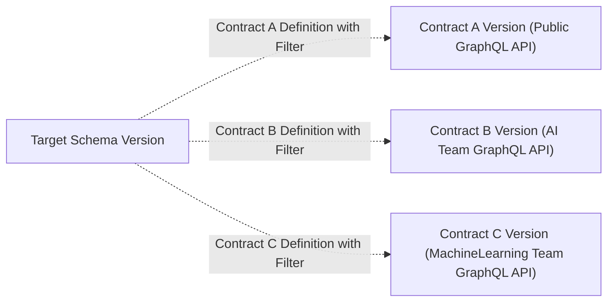

import NextImage from 'next/image'
import { Callout } from '@theguild/components'

# Contract Management

<Callout type="warning">
  Right now, contracts are only supported for **Federation** projects. If you want to use contracts
  with a non-federated project [please let us
  know](https://github.com/kamilkisiela/graphql-hive/issues/3856).
</Callout>

A GraphQL schema contract allows you to define subsets of your schema that can be distributed to
different consumers.

## Overview

You may have a GraphQL schema that contains a lot of information that is only relevant to your
internal business, but also want to share parts of your GraphQL schema with external developers and
teams. Schema contracts allow you to split your GraphQL schema into multiple subsets that can be
shared with different consumers.



Each defined contract is deeply embedded into the Hive workflows for schema publishing and schema
checks.

For each schema check

For each contract definition, Hive runs:

- **Schema Checks.** Ensure you are not accidentally breaking contract schema consumers.
- **Schema Publishing.** Contract schemas are published to the schema registry as part of the schema
  publishing process. Each valid contract version is published to the high-availability CDN (SDL and
  Supergraph).

### Federation Contracts

In Federation subgraphs, fields can be tagged with the `@tag` directive.

```graphql filename="Example Subgraph" {6,11,12,13}
extend schema
  @link(
    url: "https://specs.apollo.dev/federation/v2.0"
    import: [
      "@key"
      "@tag" # Tag Directive Import
    ]
  )

type Product @key(fields: "id") {
  id: ID! @tag(name: "public")
  name: String! @tag(name: "public")
  price: Int! @tag(name: "public")
  topCustomers: [User!]!
}

type Query {
  product(id: ID!): Product @tag(name: "public")
}
```

The provided value for the `name` argument is used to tag fields or types. Later on the values (e.g.
`public`) can be used to define a contract within Hive.

If you have the following subgraph.

```graphql
extend schema
  @link(
    url: "https://specs.apollo.dev/federation/v2.0"
    import: [
      "@key"
      "@tag" # Tag Directive Import
    ]
  )

type Query {
  a(id: ID!): Int @tag(name: "public")
  b(id: ID!): Int
}
```

The public graph will look like the following.

```graphql filename="Supergraph"
type Query {
  a(id: ID!): Int
  b(id: ID!): Int
}
```

If you now set up a contract that only includes fields tagged with `@tag(name: "public")` the
contract graph will look like the following.

```graphql filename="Contract Graph"
type Query {
  a(id: ID!): Int
}
```

## Define a Contract

Contracts are defined within the Hive application. You can define a contract by navigating to the
Target settings.

import settingsPageImage from '../../../../public/docs/pages/management/contracts/settings-page.png'

<NextImage
  alt="Target Settings"
  src={settingsPageImage}
  className="mx-auto mt-10 rounded-lg drop-shadow-md"
/>

On the settings page, there is a schema contracts section.

import schemaContractsSettingsEmptyImage from '../../../../public/docs/pages/management/contracts/schema-contracts-settings-empty.png'

<NextImage
  alt="Schema contract section in target settings"
  src={schemaContractsSettingsEmptyImage}
  className="mx-auto mt-10 rounded-lg drop-shadow-md"
/>

Click the "Create new contract" button to create a new contract.

import createSchemaContractModalImage from '../../../../public/docs/pages/management/contracts/create-schema-contract-modal.png'

<NextImage
  alt="Create Schema Contract Modal"
  src={createSchemaContractModalImage}
  className="mx-auto mt-10 rounded-lg drop-shadow-md"
/>

Within the dialogue, you need to define the name of the contract and the filter.

The contract name must be unique within the target. There can not be two contracts with the same
name.

For the filter, you at least need to define one include or one exclude tag. We recommend using
include tags over exclude tags as they are more explicit (and it is less likely you accidentally add
something to a contract schema that you wanted to omit).

E.g. if you are using Apollo Federation you should use the `name` argument value of `@tag`
directives.

Additionally, you can also remove unreachable types from the public API schema. That means that all
types that are not accessible from the root Query, Mutation and Subscription type will be removed
from the public API schema.

After that, press the "Create Contract" button to create the contract.

import createSchemaContractModalConfirmImage from '../../../../public/docs/pages/management/contracts/create-schema-contract-modal-confirm.png'

<NextImage
  alt="create schema contract confirmation modal"
  src={createSchemaContractModalConfirmImage}
  className="mx-auto mt-10 rounded-lg drop-shadow-md"
/>

If the contract creation succeeds you will see the success modal. Close the modal and you will now
see the contract in the schema contracts section.

import schemaContractsSettingsContractImage from '../../../../public/docs/pages/management/contracts/schema-contracts-settings-contract.png'

<NextImage
  alt="Schema contract section in target settings with created contract"
  src={schemaContractsSettingsContractImage}
  className="mx-auto mt-10 rounded-lg drop-shadow-md"
/>

The contract is now active and used for subsequent schema checks and schema publishing runs within
the target. Note that the first contract version will only be published after the next schema is
published within the target.

## Contracts in Schema Checks

When you run a schema check, Hive will run the schema check for each contract definition. That means
if the composition of the contract schema is not valid, or the contract schema contains breaking
changes, the schema check will fail.

import schemaChecksContractExample from '../../../../public/docs/pages/management/contracts/schema-checks-contract-example.png'

<NextImage
  alt="Contract in Schema Checks"
  src={schemaChecksContractExample}
  className="mx-auto mt-10 rounded-lg drop-shadow-md"
/>

## Contracts in Schema Publishing

Hive will publish the contract schema to the schema registry when you run a schema publishing run.
Within the History view of a target, you can see how the contract schema has evolved.

import schemaHistoryContractDiffTextImage from '../../../../public/docs/pages/management/contracts/schema-history-contract-diff-text.png'

<NextImage
  alt="Changes listed in the schema version history for a contract"
  src={schemaHistoryContractDiffTextImage}
  className="mx-auto mt-10 rounded-lg drop-shadow-md"
/>

You can also see the direct changes on the SDL or Supergraph to the previous schema version.

import schemaHistoryContractDiffGitStyle from '../../../../public/docs/pages/management/contracts/schema-history-contract-diff-git-style.png'

<NextImage
  alt="Supergraph Diff from one contract version to the next using a diff view"
  src={schemaHistoryContractDiffGitStyle}
  className="mx-auto mt-10 rounded-lg drop-shadow-md"
/>

## Access Contract CDN Artifacts

Artifacts such as the SDL and Supergraph of a contract are available on the High-Availability CDN.
Within the "Connect to CDN" modal, you can find the URLs for accessing the contract artifacts.

import hiveCdnAccessContractImage from '../../../../public/docs/pages/management/contracts/hive-cdn-access-contract.png'

<NextImage
  alt="Selecting the contract in the connect to CDN modal"
  src={hiveCdnAccessContractImage}
  className="mx-auto mt-10 rounded-lg drop-shadow-md"
/>

## Serving a Contract Schema

### Apollo Router

Apollo Router is not able to serve more than a single GraphQL endpoint with different supergraphs.
We recommend using multiple Apollo Router instances to serve different contract schemas. Point
Apollo Router to the contract supergraph from the CDN.
