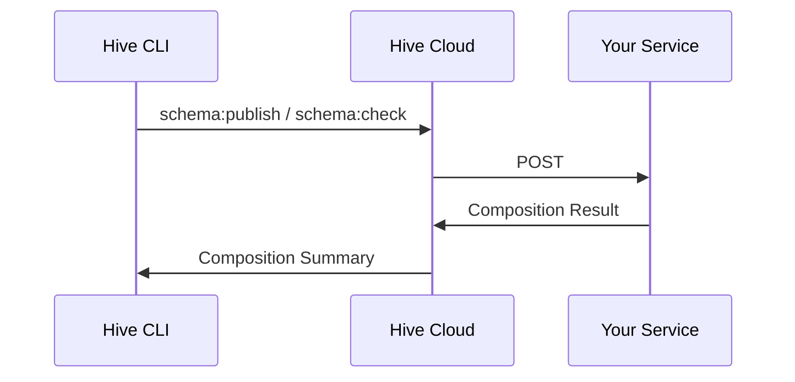

import NextImage from 'next/image'
import { Callout, Steps, Tabs } from '@theguild/components'
import externalCompositionInvalid from '../../../../public/docs/pages/management/external-composition-invalid.png'
import externalCompositionValid from '../../../../public/docs/pages/management/external-composition-valid.png'
import externalCompositionOff from '../../../../public/docs/pages/management/external-schema-composition-disabled.png'
import externalCompositionOn from '../../../../public/docs/pages/management/external-schema-composition-enabled.png'

# External Schema Composition (for Apollo Federation v2)

**External Schema Composition** feature allows you to build and validate GraphQL Schema outside of
Hive. When enabled, Hive will send necessary information over HTTP to your endpoint and expect a
composition result in return.

To make this process easier, we've implemented the actual service that you need to deploy: either as
a JavaScript library, or as a Docker image that can be deployed anywhere.

<Callout type="info" emoji="👩‍🔬">
**Native Apollo Federation v2 support is coming soon**

We're currently developing a new functionality that enables you to utilize Apollo Federation v2
seamlessly with Hive Cloud, **eliminating the need for you to manage your own composition server**.

To gain early access to this feature, submit a support ticket (_🛟 Support_ in user menu), and we'll
activate it for your project.

</Callout>

<Callout type="warning">

**Why external composition is required for Apollo Federation v2?**

As part of the Apollo Federation v2 release,
[Apollo changed their product license from MIT to Elastic License v2](https://www.apollographql.com/blog/announcement/moving-apollo-federation-2-to-the-elastic-license-v2/).
This means that Hive Cloud cannot use Apollo Federation v2 libraries directly, or offer Cloud
services that uses the new properitey libraries internally.

**To use Apollo Federation v2 with your Hive project, you have to run your own composition server
and connect it to Hive.**

</Callout>

## How does it work?



<Callout>
Your deployed external composition service needs to be available publicly, to make it possible for
Hive Cloud service to communicate with it. Don't worry: we've implemented a security layer to make
sure only Hive can communicate with your service.

Hive Cloud uses Cloudflare Worker to communicate with your service. This means that service's
address must contain a valid hostname (not an IP address), and the port must be standard.

</Callout>

## Integration Guide

<Steps>

### Deploy External Composition Service

<Tabs items={['One-click Deployment', 'Pre-built Docker Image', 'JavaScript Library']}>
  <Tabs.Tab>
    You can use our one-click deployment to deploy your External Composition Service to Heroku:

    <a target="_blank" href="https://dashboard.heroku.com/new?template=https%3A%2F%2Fgithub.com%2Fdotansimha%2Fgraphql-hive-external-composition-heroku-template">
      
    </a>

  </Tabs.Tab>
  <Tabs.Tab>
We provide a prebuilt
[Docker image](https://github.com/kamilkisiela/graphql-hive/pkgs/container/graphql-hive%2Fcomposition-federation-2)
for running External Composition Service for Apollo Federation v2.

The pre-built image implements the best-practice to secure your endpoint, and uses the latest
version of **Apollo Federation v2**.

Start by deciding on your encryption secret. This is needed in order to ensure you endpoint is
secured and can be triggered only by Hive platform. Your secret can be any string you decide, and it
will be used as private key to hash the requests to your composition service.

To run the container, you can use the following command:

```bash
docker run -p 3069:3069 -e SECRET="MY_SECRET_HERE" \
  ghcr.io/kamilkisiela/graphql-hive/composition-federation-2
```

You should make this service publicly available, and then configure it in Hive platform.

  </Tabs.Tab>
  <Tabs.Tab>
You can also build your own JavaScript/NodeJS server for the composition endpoint. The following example shows how to
do that.

The following example shows how to implement an External Composition endpoint for Apollo Federation
v2 in NodeJS.

```sh npm2yarn
npm i -D @graphql-hive/external-composition
```

<Callout type="info">
  The `@graphql-hive/external-composition` library provides a thin `compose` function to bring
  auto-completion and type-safety to your IDE.
</Callout>

```javascript filename="Simple Fastify server for External Composition"
import fastify from 'fastify'
import { parse, printSchema } from 'graphql'
import { composeServices } from '@apollo/composition'
import { compose, signatureHeaderName, verifyRequest } from '@graphql-hive/external-composition'

const composeFederation = compose(services => {
  const result = composeServices(
    services.map(service => {
      return {
        typeDefs: parse(service.sdl),
        name: service.name,
        url: service.url
      }
    })
  )

  if (result.errors?.length) {
    return {
      type: 'failure',
      result: {
        errors: result.errors.map(error => ({
          message: error.message,
          source: typeof error.extensions?.code === 'string' ? 'composition' : 'graphql'
        }))
      }
    }
  } else {
    return {
      type: 'success',
      result: {
        supergraph: result.supergraphSdl,
        sdl: printSchema(result.schema.toGraphQLJSSchema())
      }
    }
  }
})

const server = fastify()

server.route({
  method: ['POST'],
  url: '/compose',
  handler(req, res) {
    const error = verifyRequest({
      // Stringified body, or raw body if you have access to it
      body: JSON.stringify(req.body),
      // Pass here the signature from `X-Hive-Signature-256` header
      signature: req.headers[signatureHeaderName],
      // Pass here the secret you configured in Hive
      secret: YOUR_SECRET_HERE
    })

    if (error) {
      // Failed to verify the request - send 500 and the error message back
      res.status(500).send(error)
    } else {
      const result = composeFederation(req.body)
      // Send the result back (as JSON)
      res.send(JSON.stringify(result))
    }
  }
})

await server.listen({
  port: 3000
})
```

<Callout type="info">
  You can also find here [an example using NodeJS's HTTP
  library](https://github.com/kamilkisiela/graphql-hive/blob/4af001a7102b255bd8ceb8e3f01722faceb8f2f3/packages/services/external-composition/federation-2).
</Callout>

To make sure your server is only receiving requests from Hive, you can use the secret provided in
the configuration and verify the signature of the request.

> Please contact us if you need to limit access by whitelisting an IP address.

The logic of verifying the signature is as follows:

1. Get the value of `X-Hive-Signature-256` header.
1. Take the raw body of the request.
1. Use an HMAC hex digest (`sha256`) to compute the hash (body with the secret provided in the
   configuration).
1. Compare the result with the value of the `X-Hive-Signature-256` header (use "constant-time"
   comparison).

A NodeJS example of the verification process:

```javascript
import crypto from 'node:crypto'

const sigHashAlg = 'sha256'

function hash(secret: string, data: string) {
  return crypto.createHmac(sigHashAlg, secret).update(data, 'utf-8').digest('hex')
}

function verifyRequest(input) {
  const { body, signature, secret } = input

  if (!body) {
    return 'ERR_EMPTY_BODY'
  }

  const sig = Buffer.from(signature ?? '', 'utf8')
  const digest = Buffer.from(hash(secret, body), 'utf8')

  if (sig.length !== digest.length || !crypto.timingSafeEqual(digest, sig)) {
    return 'ERR_INVALID_SIGNATURE'
  }

  // signature is valid
}
```

  </Tabs.Tab>
</Tabs>

### Connect to Hive

Start by enabling the **External Composition** for your project. To do that, go to your Hive project
page, and click the **Settings** tab. You'll notice a **"External Composition"** section.

<NextImage
  alt="External Composition section in the project settings"
  src={externalCompositionOff}
  className="mt-10 max-w-xl rounded-lg drop-shadow-md"
/>

Next, provide the URL of your deployed endpoint, and also set the secret you set for your service.
Click **Save**.

<NextImage
  alt="External Composition section in the project settings"
  src={externalCompositionOn}
  className="mt-10 max-w-xl rounded-lg drop-shadow-md"
/>

If your service is available publicly and the secret matches, you should see a green checkmark next
to the URL:

<NextImage
  alt="Valid External Composition"
  src={externalCompositionValid}
  className="mt-6 max-w-xl rounded-lg drop-shadow-md"
/>

In case of a failure, you'll see a red cross with the reason of the failure:

<NextImage
  alt="Valid External Composition"
  src={externalCompositionInvalid}
  className="mt-6 max-w-xl rounded-lg drop-shadow-md"
/>

Now you should be able to use the **External Composition** feature in your project.
[Publish a GraphQL schema](/docs/features/schema-registry#publish-a-schema) or perform a
[GraphQL schema check](/docs/features/schema-registry#check-a-schema) to validate your setup.

</Steps>

## Protocol Specification

You can use the following as reference for the expected shape of the request and response payloads.

<Callout type="info">
  Your external composition service will have 60s to complete the composition process, otherwise
  Hive server will result in a timeout.
</Callout>

<details>
  <summary>Request</summary>

Hive will dispatch your HTTP service using `POST` method, with the following headers:

- `content-type: application/json`
- `x-hive-signature-256` will be set the to the signature of the request body once encrypted with
  the secret you provided in the configuration.

The request body will contain the following information:

```typescript
type SchemaService = {
  sdl: String!
  name: String!
  url: String
}

type RequestBody = Array<SchemaService>
```

Example request:

```json
[
  {
    "sdl": "type Query { users: [String] }",
    "name": "users",
    "url": "https://api.com/users"
  },
  {
    "sdl": "extend type Query { comments: [String] }",
    "name": "comments",
    "url": "https://api.com/comments"
  }
]
```

</details>

<details>
  <summary>Response</summary>

Hive will expect your HTTP service to respond with `200` status code and the following headers:

- `content-type: application/json`

The reponse payload should match the following type:

```typescript
type CompositionResult = CompositionSuccess | CompositionFailure

type CompositionSuccess = {
  type: 'success'
  result: {
    supergraph: string
    sdl: string
  }
}

type CompositionFailure = {
  type: 'failure'
  result: {
    errors: Array<{
      message: string
      source: 'graphql' | 'composition'
    }>
  }
}
```

Example response:

```json
{
  "type": "failure",
  "result": {
    "errors": [
      {
        "message": "Type \"Query\" was defined more than once.",
        "source": "graphql"
      }
    ]
  }
}
```

In the `source` you are expected to return `graphql` if the error is related to the schema itself,
or `composition` if the error is related to the composition process with other schemas.

</details>
