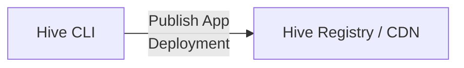
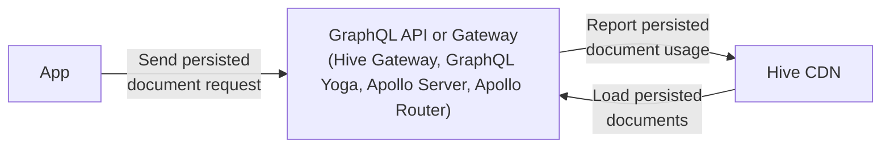
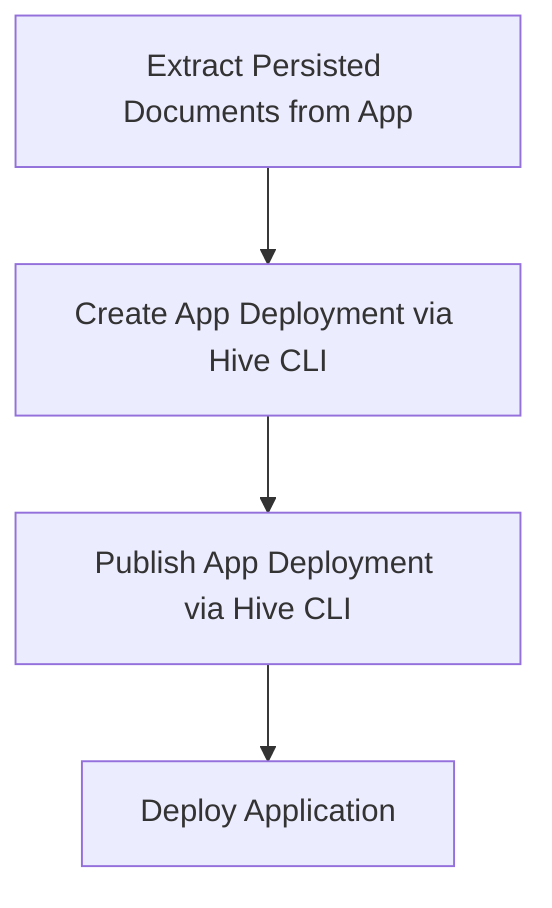

import NextImage from 'next/image'
import { Callout, Tabs } from '@theguild/components'

# App Deployments

<Callout>
  <div>
    App deployments are currently in preview. If you would like to try them out, please{' '}
    <a
      href="#"
      className="inline-block underline"
      onClick={() => {
        window?.$crisp?.push(['do', 'chat:open'])
      }}
    >
      reach out to us
    </a>
    {/* If we move the dot out of the quotations/brackets, it will be a new paragraph... */}
    {'.'}
  </div>
</Callout>

App deployments are a way to group and publish your GraphQL operations as a single app version to
the Hive Registry. This allows you to keep track of your different app versions, their operations
usage, and performance.

Making better decisions about:

- Which operations are being used by what app client version (mobile app, web app, etc.)
- Which team or developer is responsible for a specific operation and needs to be contacted for
  Schema change decissions



Furthermore, it allows you to leverage persisted documents (also knows as trusted documents or
persisted queries) on your GraphQL Gateway or server, which provides the following benefits:

- Reduce payload size of your GraphQL requests (reduce client bandwidth usage)
- Secure your GraphQL API by only allowing operations that are known and trusted by your Gateway



## Extracting Persisted Documents

We need to extract the persisted documents from within our app. The method for doing this may vary
depending on the tools you are using.

The persisted documents must stored in a JSON file, which includes the documents along with their
corresponding hashes. This JSON file will be uploaded to the Hive Registry.

```json filename="persisted-operations.json"
{
  "d9a00ec0c1ce": "query UsageEstimationQuery($input: UsageEstimationInput!) { __typename usageEstimation(input: $input) { __typename operations } }",
  "b8d98e796421": "mutation GenerateStripeLinkMutation($selector: OrganizationSelectorInput!) { __typename generateStripePortalLink(selector: $selector) }"
}
```

These persisted documents define all the possible operations that your app can execute against your
GraphQL API.

As long as the app deployment using these persisted documents is active, any change of the GraphQL
API that alters the GraphQL schema as used by any of the persisted documents would break that
specific app version and therefore be an unsafe/breaking change.

<Tabs items={["GraphQL Code Generator", "Relay Compiler"]}>

<Tabs.Tab>

For GraphQL Code Generator, you can configure the client preset to generate the persisted document
manifest.

```typescript filename="codegen.ts" {9-11}
import { type CodegenConfig } from '@graphql-codegen/cli'

const config: CodegenConfig = {
  schema: 'schema.graphql',
  documents: ['src/**/*.tsx'],
  generates: {
    './src/gql/': {
      preset: 'client',
      presetConfig: {
        persistedDocuments: true
      }
    }
  }
}
```

After running the Relay Compiler, the file `persisted-documents.json` will be generated. This file
can be used for creating a new app deployment on Hive.

For more information,
[please refer to the GraphQL Code Generator documentation](https://the-guild.dev/graphql/codegen/plugins/presets/preset-client#enable-persisted-documents).

</Tabs.Tab>

<Tabs.Tab>

For Relay Compiler, you can configure the compiler to generate the persisted document manifest.

```js filename="relay.config.js" {6-8}
module.exports = {
  src: './src',
  language: 'javascript',
  schema: './data/schema.graphql',
  excludes: ['**/node_modules/**', '**/__mocks__/**', '**/__generated__/**'],
  persistConfig: {
    file: './persisted-documents.json'
  }
}
```

After running the Relay Compiler, the file `persisted-documents.json` will be generated. This file
can be used for creating a new app deployment on Hive.

For more information,
[please refer to the Relay documentation](https://relay.dev/docs/guides/persisted-queries/#local-persisted-queries).

</Tabs.Tab>

</Tabs>

## Create an App Deployment

To create an app deployment with the extracted persisted documents, you need to have
[the Hive CLI installed](/docs/api-reference/cli#installation) and authenticated with your Hive
target, on which you want to deploy your app.

> **Note:** The GraphQL operations being uploaded must pass validation against the target schema.
> Otherwise, the app deployment creation will fail.

Once the pre-requisites are met, you can create an app deployment by running the following command.

```bash filename="Create an App Deployment via CLI"
hive app:create --name "my-app" --version "1.0.0" persisted-documents.json
```

The parameters `--name` and `--version` are mandatory and uniquily identify your app deployment.

| Parameter                  | Description                                                   |
| -------------------------- | ------------------------------------------------------------- |
| `--name`                   | The name of the app deployment.                               |
| `--version`                | The version of the app deployment.                            |
| `<persistedDocumentsFile>` | The path to the JSON file containing the persisted documents. |

An app deployment is uniquely identified by the combination of the `name` and `version` parameters
for each target.

After creating an app deployment, it is in the pending state. That means you can view it on the Hive
App UI.

Navigate to the Target page on the Hive Dashboard and click on the **Apps** tab to see it.

import pendingAppImage from '../../../../public/docs/pages/features/app-deployments/pending-app.png'

<NextImage
  alt="Pending App Deployment"
  src={pendingAppImage}
  className="mt-10 max-w-2xl rounded-lg drop-shadow-md"
/>

By clicking on the app deployments name, you can navigate to the app deployment details page, where
you can see all the GraphQL operations that are uploaded as part of this app deployment.

import detailAppImage from '../../../../public/docs/pages/features/app-deployments/detail-app.png'

<NextImage
  alt="App Deployment Detail View"
  src={detailAppImage}
  className="mt-10 max-w-2xl rounded-lg drop-shadow-md"
/>

## Publish an App Deployment

A app deployment will be in the pending state until you publish it. By publishing the app
deployment, the persisted documents will be available via the Hive CDN and can be used by your
Gateway or GraphQL API for serving persisted documents to your app.

To publish an app deployment, you can run the following command. Make sure you utilize the same
`--name` and `--version` parameters as you used when creating the app deployment.

```bash filename="Publish an App Deployment via CLI"
hive app:publish --name "my-app" --version "1.0.0"
```

| Parameter   | Description                        |
| ----------- | ---------------------------------- |
| `--name`    | The name of the app deployment.    |
| `--version` | The version of the app deployment. |

After publishing the app deployment, the persisted documents, the status of the app deployment on
the Hive dashboard will change to **active**.

import activeAppImage from '../../../../public/docs/pages/features/app-deployments/active-app.png'

<NextImage
  alt="Active App Deployment"
  src={activeAppImage}
  className="mt-10 max-w-2xl rounded-lg drop-shadow-md"
/>

## Persisted Documents on GraphQL Server and Gateway

Persisted documents can be used on your GraphQL server or Gateway to reduce the payload size of your
GraphQL requests and secure your GraphQL API by only allowing operations that are known and trusted
by your Gateway.

Hive serves as the source of truth for the allowed persisted documents and provides a CDN for
fetching these documents as they are requested.

<Tabs items={['Hive Gateway', 'GraphQL Yoga', 'Apollo Server', 'Apollo Router', 'Custom Third-Party Integration']}>

{/* Hive Gateway */}

<Tabs.Tab>

For Hive Gateway you can use the Hive configuration for resolving persisted documents. Adjust your
`gateway.config.ts` file as follows.

```ts filename="gateway.config.ts"
import { defineConfig } from '@graphql-hive/gateway'

export const gatewayConfig = defineConfig({
  persistedDocuments: {
    type: 'hive',
    endpoint: '<cdn_endpoint>',
    token: '<cdn-access-token>'
  }
})
```

For further information, please refer to the
[Hive Gateway documentation for persisted documents](/docs/gateway/persisted-documents).

</Tabs.Tab>

{/* GraphQL Yoga */}

<Tabs.Tab>

For GraphQL Yoga you can use the Hive CDN for resolving persisted documents via the Hive SDK.

```sh npm2yarn
npm i -D @graphql-hive/yoga
```

```typescript filename="Persisted Documents with GraphQL Yoga" {10-16}
import { createYoga } from 'graphql-hive'
import { useHive } from '@graphql-hive/yoga'
import schema from './schema.js'

const yoga = createYoga({
  schema,
  plugins: [
    useHive({
      enabled: false
      experimental__persistedDocuments: {
        cdn: {
          // replace <target_id> and <cdn_access_token> with your values
          endpoint: 'https://cdn.graphql-hive.com/<target_id>',
          accessToken: '<cdn_access_token>'
        }
      }
    })
  ]
})
```

For further configuration options, please refer to the
[Hive Client API reference](/docs/api-reference/client#persisted-documents).

</Tabs.Tab>

{/* Apollo Server */}

<Tabs.Tab>

For Apollo Server you can use the Hive CDN for resolving persisted documents via the Hive SDK.

```sh npm2yarn
npm i -D @graphql-hive/apollo
```

```typescript filename="Persisted Documents with Apollo Server" {10-16}
import { ApolloServer } from '@apollo/server'
import { useHive } from '@graphql-hive/apollo'
import schema from './schema.js'

const server = new ApolloServer({
  schema,
  plugins: [
    useHive({
      experimental__persistedDocuments: {
        cdn: {
          // replace <target_id> and <cdn_access_token> with your values
          endpoint: 'https://cdn.graphql-hive.com/<target_id>',
          accessToken: '<cdn_access_token>'
        }
      }
    })
  ]
})
```

For further configuration options, please refer to the
[Hive Client API reference](/docs/api-reference/client#persisted-documents).

</Tabs.Tab>

{/* Apollo Router */}

<Tabs.Tab>

Using the Hive Schema Registry for persisted documents with Apollo Router is currently not
supported. Progress of the support is tracked in
[this GitHub issue](https://github.com/graphql-hive/platform/issues/5498).

</Tabs.Tab>

{/* Custom Third Party */}

<Tabs.Tab>

Any published app deployment is available via the Hive CDN. You can fetch a the persisted documents
by doing a HTTP GET request.

```text filename="Fetch Persisted Document via HTTP"
GET https://cdn.graphql-hive.com/<target_id>/apps/<app_name>/<app_version>/<document_hash>
```

| Parameter       | Description                                                             |
| --------------- | ----------------------------------------------------------------------- |
| `target_id`     | The target ID of the Hive target where the app deployment is published. |
| `app_name`      | The name of the app deployment.                                         |
| `app_version`   | The version of the app deployment.                                      |
| `document_hash` | The hash of the persisted document.                                     |

**Example curl request:**

```bash filename="Example curl request"
curl \
  -L \
  -H 'X-Hive-CDN-Key: CDN_ACCESS_TOKEN' \
  https://cdn.graphql-hive.com/<target_id>/apps/<app_name>/<app_version>/<document_hash>
```

**Expected responses:**

| Response Status | Description                                                             |
| --------------- | ----------------------------------------------------------------------- |
| 200             | The persisted document was found and is returned in the response body.  |
| 404             | The persisted document does not exist.                                  |
| 401             | The request is unauthorized. A valid CDN access token must be provided. |

</Tabs.Tab>

</Tabs>

## Sending Persisted Document Requests from your App

Once you have the persisted documents available on your GraphQL server or Gateway, you can send a
GraphQL request with the persisted document ID following the GraphQL over HTTP specification.

<Tabs items={["curl", "Apollo Client", "Urql", "Relay"]}>

<Tabs.Tab>

```text filename="GraphQL Request with Persisted Document"
POST /graphql
Content-Type: application/json
{
  "documentId": "<app_name>~<app_version>~<document_hash>",
}
```

| Parameter       | Description                         |
| --------------- | ----------------------------------- |
| `app_name`      | The name of the app deployment.     |
| `app_version`   | The version of the app deployment.  |
| `document_hash` | The hash of the persisted document. |

**Example curl request:**

```bash filename="Example curl request"
curl \
  -X POST \
  -H 'Content-Type: application/json' \
  -d '{"documentId": "<app_name>~<app_version>~<document_hash>"}' \
  http://localhost:4000/graphql
```

</Tabs.Tab>

<Tabs.Tab>

The code demonstrates how to send a persisted document request using Apollo Client. Make sure to
replace the placeholders with your actual values.

```typescript filename="Apollo Client Persisted Document Configuration"
import { ApolloClient, HttpLink, InMemoryCache } from '@apollo/client'
import { createPersistedQueryLink } from '@apollo/client/link/persisted-queries'

// replace <app_name>, <app_version>, and with your values
const appVersionPrefix = '<app_name>~<app_version>~'

const persistedQueriesLink = createPersistedQueryLink({
  generateHash(document) {
    // GraphQL Code Generator Client Preset generates
    // the persisted document ID within the document node.
    // For other implementations return the hash prefixed with the app version.
    if (document?.['__metadata__']?.['hash']) {
      throw Error('Hash not available for document')
    }
    return appVersionPrefix + document['__metadata__']['hash']
  }
})

const httpLink = new HttpLink({
  uri: '/graphql',
  fetch(url, init) {
    const parsedBody = JSON.parse(init!.body as string)
    return fetch(url, {
      ...init,
      body: JSON.stringify({
        variables: parsedBody.variables,
        documentId: parsedBody.extensions.persistedQuery.sha256Hash,
        extensions: { ...parsedBody.extensions, persistedQuery: undefined }
      })
    })
  }
})

const client = new ApolloClient({
  cache: new InMemoryCache(),
  link: persistedQueriesLink.concat(httpLink)
})
```

| Parameter       | Description                        |
| --------------- | ---------------------------------- |
| `<app_name>`    | The name of the app deployment.    |
| `<app_version>` | The version of the app deployment. |

</Tabs.Tab>

<Tabs.Tab>

The code demonstrates how to send a persisted document request using Urql. Make sure to replace the
placeholders with your actual values.

```typescript filename="Urql Persisted Document Configuration"
import { createClient, fetchExchange, mapExchange } from 'urql'

// replace <app_name>, <app_version>, and with your values
const appVersionPrefix = '<app_name>~<app_version>~'

const urqlClient = createClient({
  url: '/graphql',
  exchanges: [
    mapExchange({
      onOperation(op) {
        if (op.query?.['__metadata__']?.['hash']) {
          throw Error('Hash not available for document')
        }

        return {
          ...op,
          query: {
            documentId:
              // GraphQL Code Generator Client Preset generates
              // the persisted document ID within the document node.
              // For other implementations return the hash prefixed with the app version.
              appVersionPrefix + op.query['__meta__']['hash'],
            definitions: []
          }
        }
      }
    }),
    fetchExchange
  ]
})
```

| Parameter       | Description                        |
| --------------- | ---------------------------------- |
| `<app_name>`    | The name of the app deployment.    |
| `<app_version>` | The version of the app deployment. |

</Tabs.Tab>

<Tabs.Tab>

Update your Relay environment configuration to send persisted document requests instead of the
document.

```typescript filename="Relay Persisted Document Configuration"
// replace <app_name>, <app_version>, and with your values
const appVersionPrefix = '<app_name>~<app_version>~'

function fetchQuery(operation, variables) {
  if (!operation.id) {
    throw new Error('No persisted document hash provided.')
  }

  return fetch('/graphql', {
    method: 'POST',
    headers: {
      'content-type': 'application/json'
    },
    body: JSON.stringify({
      documentId: appVersionPrefix + operation.id,
      variables
    })
  }).then(response => response.json())
}
```

| Parameter       | Description                        |
| --------------- | ---------------------------------- |
| `<app_name>`    | The name of the app deployment.    |
| `<app_version>` | The version of the app deployment. |

</Tabs.Tab>

</Tabs>

## Continous Deployment (CD) Integration

We recommend integrating the app deployment creation and publishing into your CD pipeline for
automating the creationg and publishing of app deployments.

Usually the following steps are performed.



Since the application will be configured to send requests with the persisted document ID, we need to
ensure that these documents are available on the Hive CDN before deploying the application.

Extracting the persisted documents usually happens during the build step of your application. E.g.
if you are using GraphQL Code Generator with the client preset or Relay, the persisted document JSON
mapping is generated as an artifact.

In your CLI pipeline, you can then use the Hive CLI (or Hive CLI docker container) to create and
publish the app deployment.

After that, you can deploy your application with confidence.

Tools like GitHub Actions, Pulumni, or Terraform can be used to model this flow. We use it ourselves
for
[deploying the GraphQL Hive Dashboard using Pulumni](https://github.com/graphql-hive/platform/blob/main/deployment/utils/publish-app-deployment.ts).
