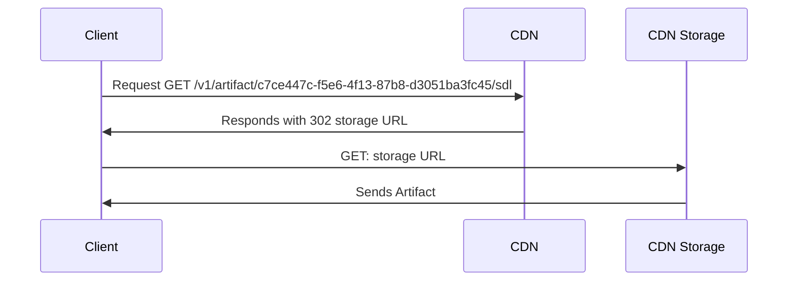

import { Callout } from '@theguild/components'

# High Availability CDN

GraphQL Hive allows exposing your Graph via a CDN, which is a great way to improve performance and
availability. The CDN is powered by Cloudflare, which is a global CDN provider with a great track
record of performance and availability.

Currently you can access the single services, merged schema, supergraph and metadata (e.g. GraphQL
Mesh artifacts) via the CDN.

## Generating the CDN Key

On the target page of the GraphQL Hive dashboard, click on the "Connect" button. It will open you a
modal that shows you the CDN URL and the CDN Key.

<Callout>
  The CDN Key is a secret and should not be shared with anyone else. Currently, it is impossible to
  revoke a CDN key.
</Callout>


## Loading Artifacts from the CDN

The artifacts are stored on an S3 compatible bucket. In order to load them, you need to send a `GET`
request to the CDN URL with the `x-hive-cdn-key` header.



```text filename="Example curl Request for accessing SDL"
curl -v -H 'X-Hive-CDN-Key: kAZlQN8U7q8pMsAMVpA0fBeRvvbaKt1h9JniZbi3+5k=' \
  https://cdn.graphql-hive.com/v1/c7ce447c-f5e6-4f13-87b8-d3051ba3fc45/sdl


> GET /artifacts/v1/c7ce447c-f5e6-4f13-87b8-d3051ba3fc45/sdl
< Found 302
< Header: location https://6d5bc18cd8d13babe7ed321adba3d8ae.r2.cloudflarestorage.com/artifacts/c7ce447c-f5e6-4f13-87b8-d3051ba3fc45/sdl
Found.
```

In case the request was successfull (correct authorization header was provided and the artifact
exists). The CDN will respond with status code `302`. You can now access the artifact via the
provided URL in the `location` header. The link is valid for 60 seconds.

## Available Artifacts

Currently you can access the single services, merged schema SDL, supergraph and metadata (e.g.
GraphQL Mesh artifacts) via the CDN.

### Merged schema SDL

```bash
curl -v -H 'X-Hive-CDN-Key: kAZlQN8U7q8pMsAMVpA0fBeRvvbaKt1h9JniZbi3+5k=' \
  "https://cdn.graphql-hive.com/v1/artifacts/<target_id>/sdl"
```

### Services

```bash
curl -v -H 'X-Hive-CDN-Key: kAZlQN8U7q8pMsAMVpA0fBeRvvbaKt1h9JniZbi3+5k=' \
  "https://cdn.graphql-hive.com/v1/artifacts/<target_id>/services"
```

### Supergraph

<Callout>This is only available for Federated targets.</Callout>

```bash
curl -v -H 'X-Hive-CDN-Key: kAZlQN8U7q8pMsAMVpA0fBeRvvbaKt1h9JniZbi3+5k=' \
  "https://cdn.graphql-hive.com/v1/artifacts/<target_id>/supergraph"
```

### Metadata

<Callout>This is only available for Mesh projects.</Callout>

```bash
curl -v -H 'X-Hive-CDN-Key: kAZlQN8U7q8pMsAMVpA0fBeRvvbaKt1h9JniZbi3+5k=' \
  "https://cdn.graphql-hive.com/v1/artifacts/<target_id>/metadata"
```
