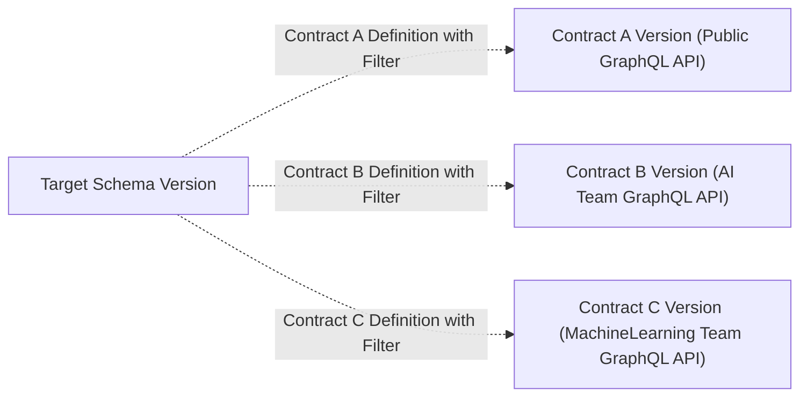

We added support schema contracts for Federation projects. This was highly a requested feature.

Schema contracts solve an interesting problem. You may have a GraphQL schema that contains a lot of
information that is only relevant to your internal business, but also want to share parts of your
GraphQL schema with external developers and teams. Schema contracts allow you to split your GraphQL
schema into multiple subsets that can be shared with different consumers.

Each defined contract is deeply embedded into the Hive workflows for schema publishing and schema
checks.

For each contract definition, Hive runs:

- **Schema Checks.** Ensure you are not accidentally breaking contract schema consumers.
- **Schema Publishing.** Contract schemas are published to the schema registry as part of the schema
  publishing process. Each valid contract version is **published to the high-availability CDN** (SDL
  and Supergraph), allowing you to start an Apollo Router instance with the contract supergraph.

[Head over to our documentation to learn more](/management/contracts).
