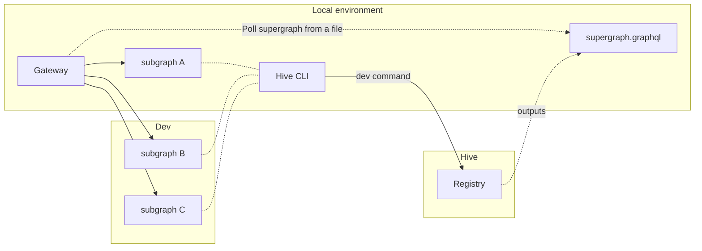

When developing a Supergraph, you may want to test your local subgraph or subgraphs against the rest
of the GraphQL schema.

This is now possible with the new `dev` command in the [Hive CLI](../docs/api-reference/cli.mdx)
(_only available for Federation projects_).

```bash
hive dev --service reviews --url http://localhost:3001/graphql
```

This command allows you to replace the subgraph(s) available in the Registry with your local
subgraph(s) and compose a Supergraph.

The result of executing this command is a file containing the Supergraph SDL, which can be feed into
the gateway of choice.



Rather than uploading your local schema to the registry and retrieving the supergraph from the CDN,
you can integrate your local modifications directly into the supergraph. This speeds up the whole
process of developing and testing your subgraph.

## Usage

Let's say you have two subgraphs, `reviews` and `products`, and you want to test the `reviews`
service.

First, you need to start the `reviews` service locally and then run the following command:

```bash
hive dev --watch --service reviews --url http://localhost:3001/graphql
```

This command will fetch subgraph's schema from the provided URL, replace the original `reviews`
subgraph from the Registry with the local one, and compose a supergraph. The outcome will be saved
in the `supergraph.graphql` file.

The `products` subgraph will stay untoched, meaing that the gateway will route requests to its
remote endpoint.

> The `--watch` flag will keep the process running and update the supergraph whenever the local
> schema changes.

Now you're ready to use the `supergraph.graphql` file in your gateway and execute queries.

## Other examples

```bash
# Introspect the SDL of the local service
hive dev --service reviews --url http://localhost:3001/graphql

# Watch mode
hive dev --service reviews --url http://localhost:3001/graphql --watch

# Provide the SDL of the local service
hive dev --service reviews --url http://localhost:3001/graphql --schema reviews.graphql

# Multiple services
hive dev \
  --service reviews --url http://localhost:3001/graphql \
  --service products --url http://localhost:3002/graphql --schema products.graphql

# Custom output file (default: supergraph.graphql)
hive dev --service reviews --url http://localhost:3001/graphql --write super.graphql
```
