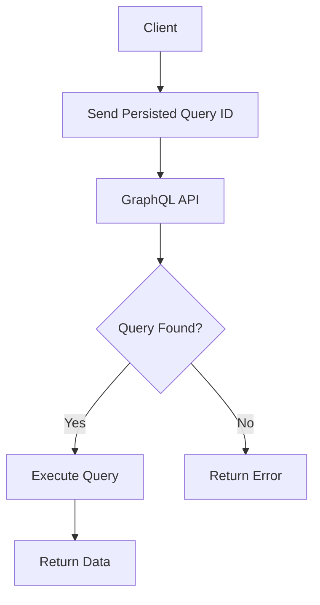
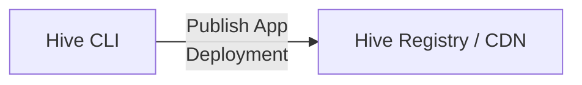
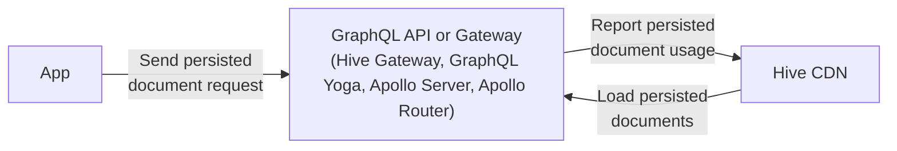

import NextImage from 'next/image'

**TL;DR** Persisted documents through app deployments are now available in preview on Hive and allow
you to secure your GraphQL API. To get started, please refer to the
[app deployments documentation](/docs/schema-registry/app-deployments).

## What are Persisted Documents?

Persisted documents (also known as persisted queries or trusted documents) are a way to pre-register
GraphQL operations that will be executed against the GraphQL API. Instead of sending a full GraphQL
query, the client sends a hash of the operation to the GraphQL API.

Using persisted documents provides the following benefits:

- Reduce the attack surface of your GraphQL API by only allowing known operations.
- Reduce the upstream traffic from GraphQL clients to the GraphQL API by only sending the hash of
  the operation

## Obstacles with Persisted Documents

The idea of persisted documents is quite simple, however maintaining them can be quite challenging,
especially if you have many apps with different versions that are all active at the same time.

All the GraphQL API replicas must have access to the persisted documents, to ensure the requested
operation hashes can be resolved to actualy GraphQL documents.

Embedding them within the GraphQL API codebase is not a good idea, as it would require deploying a
new version of the API every time a new app version is about to be deployed.

A external store is a better solution.

## App Deployments in GraphQL Hive

With the new feature in GraphQL Hive, you can now persist documents through app deployments. An app
deployment is a specific version of your application that is deployed and used by your users. A app
deployment can be a web app, a mobile app, or any other type of API client.

When you deploy a new version of your app, you can publish the persisted documents to the GraphQL
Hive registry using the Hive CLI and it will publish the persisted documents to the Hive CDN.

Your GraphQL API or Gateway will then be able to resolve the operation hashes to the actual GraphQL
documents, by accessing the Hive CDN.

Furthermore, you get analytics specific to your deployed app version, so you can make better
decisions on deprecating and removing fields from your GraphQL API schema and avoid breaking ancient
versions of your app.

import pendingAppImage from '../../../public/changelog/2024-07-30-persisted-documents-app-deployments-preview/app-deployments-overview.png'

<NextImage
  alt="App Deployments on Hive Dashboard"
  src={pendingAppImage}
  className="mt-10 max-w-2xl rounded-lg drop-shadow-md"
/>

App deployments are now available in preview on Hive. To get started, please refer to the
[app deployments documentation](/docs/schema-registry/app-deployments).
