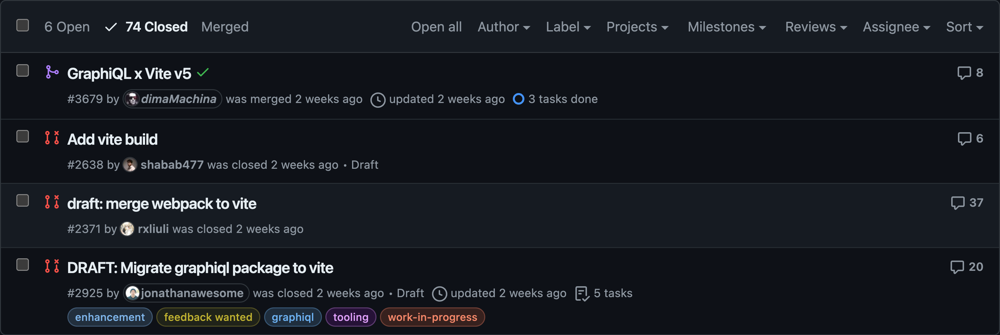

import fullScreenMode from './full-screen-mode.mp4'
import queryBuilder from './query-builder.mp4'
import newTabs from './tabs-new.mp4'
import oldTabs from './tabs-old.mp4'

export function Video({ src, alt }) {
  return (
    <>
      <video autoPlay="autoplay" loop muted playsInline>
        <source src={src} type="video/mp4" />
        Your browser does not support the video tag.
      </video>
      <p className="text-center text-sm italic">{alt}</p>
    </>
  )
}

In recent months I have worked on improving the Hive's laboratory, its new look and its new
features. And here is what was improved.

## Operations Collections Plugin

### New Look

Hive's Operations collections plugin received a new look to make consistency with Hive UI, GraphiQL
toolbars buttons "Copy Query" and "Merge fragments into query" were removed, "Prettify query" button
was moved to the end of the toolbar.


<p className="text-center text-sm italic">Old look of Operations collections plugin</p>


<p className="text-center text-sm italic">New look of Operations collections plugin</p>

### Full Screen Mode

Users with wide screens can now benefit from the fullscreen mode. The button is located in place of
the GraphiQL logo.

<Video src={fullScreenMode} alt="Full screen mode demo" />

### Tabs Support

Laboratory now supports multiple tabs, you can open tabs with different queries and switch between
them as in regular GraphiQL. There is no longer a requirement to mandatory save the query in one of
the collections, you can have a draft query which will be stored in local storage.

<Video src={newTabs} alt="Tabs demo" />

The difference Hive's tabs from regular GraphiQL tabs is the better look, I was inspired by the UX
and UI of Google Chrome tabs, and we loved the new look so much, so we decided
[to change them in the next major of GraphiQL as well](https://github.com/graphql/graphiql/pull/3644).

Also,
[tabs will be shown even if there is only a single tab](https://github.com/graphql/graphiql/pull/3713)
as per Chrome tabs UX.

And for comparison, below is how current GraphiQL tabs look like:

<Video src={oldTabs} alt="Current GraphiQL tabs demo" />

## Query Builder

The laboratory received the support of the official GraphiQL query builder plugin, named
[`@graphiql/plugin-explorer`](https://github.com/graphql/graphiql/tree/main/packages/graphiql-plugin-explorer).
While adding this plugin in the laboratory, I discovered broken styles which I fixed
[for the core package as well](https://github.com/graphql/graphiql/pull/3633).

<Video src={queryBuilder} alt="Query builder demo" />

## GraphiQL v4 Alpha

While working on improvements for the laboratory, I also cut the next major v4 alpha release of
GraphiQL, which includes a new tabs look and migration from Webpack to Vite.

> 3 times different people worked on this migration, starting from 2022, and it was finally
> migrated!



<p className="text-center text-sm italic">Vite migrations attempts</p>

If you want to try GraphiQL v4 alpha, you can install it with your favourite package manager:

```sh npm2yarn
npm i graphiql@alpha
```
