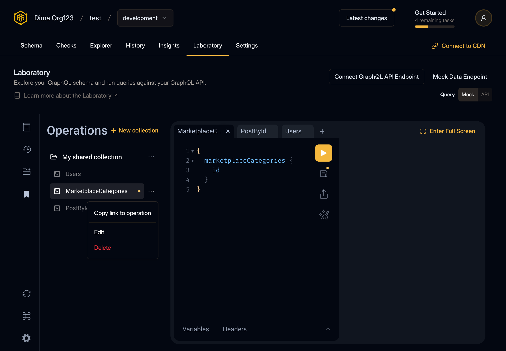

import fullScreenMode from './full-screen-mode.mp4'
import queryBuilder from './query-builder.mp4'
import newTabs from './tabs-new.mp4'

export function Caption({ children }) {
  return 
{children}

}

export function Video({ src, alt }) {
  return (
    <>
      <video autoPlay="autoplay" loop muted playsInline>
        <source src={src} type="video/mp4" />
        Your browser does not support the video tag.
      </video>
      <Caption>{alt}</Caption>
    </>
  )
}

Over the past few months, we've focused on enhancing Hive's laboratory, refining its appearance, and
adding new features. Here's what we've improved.

## Operations Collections

### New Look

Hive's Operations collections received a new look to make consistency with Hive UI, to make it
easier to use and more obvious. GraphiQL toolbars buttons "Copy Query" and "Merge fragments into
query" were removed, "Prettify query" button was moved to the end of the toolbar.

<Caption>New look of Operations collections</Caption>

### Full Screen Mode

Users with wide screens can now benefit from the fullscreen mode. The button is located in place of
the GraphiQL logo.

<Video src={fullScreenMode} alt="Full screen mode demo" />

### Tabs Support

Laboratory now supports multiple tabs, you can test as many queries as needed at the same time.
There is no longer a requirement to mandatory save the query in one of the collections, you can have
a draft query which will be stored in local storage.

<Video src={newTabs} alt="Tabs demo" />

The UI of the tabs is inspired by the functionality of Google Chrome tabs, tabs will be shown even
if there is only a single tab as per Chrome tabs UX.

## Query Builder

The laboratory now also has a query builder, which you can use to explore schema and easily
construct GraphQL queries.

<Video src={queryBuilder} alt="Query builder demo" />

## GraphiQL v4 Alpha

All the improvements are part of our ongoing work on contributing and improving
[GraphiQL](https://github.com/graphql/graphiql). We cut the next major v4 alpha release of GraphiQL,
which includes a new tabs look.
